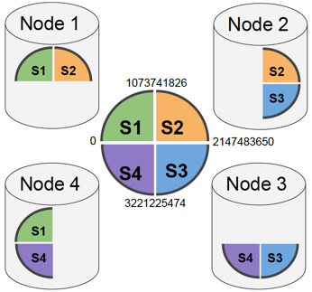

# 从无共享MPP列式数据库到弹性的云原生分析平台

                                    刘定强 2018.05.10

# 1 引言 

MPP分析数据库，尤其是作为其中领导者的Vertica，为大数据分析提供了兼容SQL和事务、高性能、低成本分析方案，分析师可以交互式地对海量数据提出问题，并以近乎实时的方式获得答案。

如果您熟悉MPP数据库，就知道MPP数据库的节点完全对称的，每个节点都在并行的执行完全相同的任务，所以它能很高效地解决海量数据的处理和分析查询问题。数据量增加性能不够了？增加节点就可以了！

但是您可能会发现，不是所有的性能问题都能简单地通过增加节点来解决。很多时候我们在月初/月末、周一/周五高并发地查询近期数据，这些近期工作数据集并不大，可能不超过10亿行，只需要3~5个节点的集群查询就会非常快了。包括公有云和私有云在内的云计算技术的成熟，极大的方便了为我们按需获取计算资源。您打算在并发请求高的时候，在集群中增加更多的节点来应对的高并发请求。可是最后却发现节点增加到一定程度后，系统的查询吞吐(很多时候被称作“并发”)能力并没有提升多少，甚至节点越多吞吐能力反而还下降了！仔细分析后您可能会发现，原来节点增加到一定程度后，额外增加的计算资源节省的时间还抵不上协调更多节点所花的开销了。

可是大数据平台上整合的数据越来越大、业务越来越多，分析查询的并发需求也越来越高。高并发请求不只是MPP数据库碰到的唯一难题。今天，云计算让我们随时都可以得到更多的计算资源，可是我们却很难做到利用这些唾手可得的计算资源来随时提升MPP数据库的性能。因为MPP数据库每个节点上都有10TB级别的数据，扩充节点意味着需要把这些数据库重新分布一遍，通常需要等待数个甚至数十个小时！务月初/月末或周一/周五业务高峰期过后，您可能希望释放一些多余的计算资源，因为它们就算被闲置着也会源源不断地给您账户里“贡献”账单。

所有这些难题的根源都在MPP数据库的架构 —— 所有节点并行完成所有任务，节点只管理和查询存储在本地的数据。如何破解这些难题，让高性能的MPP分析数据库能更好地弹性扩展吞吐能力，让集群能更快地弹性扩展？

作为MPP分析数据库的领导者，Vertica 在最新的9.1版本正式推出了新的*Eon模式*来解决上述难题。

从历史上看，Vertica为了性能和可靠性采用服务器本地磁盘，数据预先分布、有序存储在每个计算节点上，但其代价是扩展性受到一定限制。 Eon模式是Vertica的新架构，它重用了Vertica原来的优化器和执行引擎，但重构了元数据、存储和容错机制以便将数据存放在可靠的共享存储上，既能与原来无共享MPP列式存储架构支撑的工作负载的性能需求匹配，也能支持新的工作负载。新的分片(Sharding)机制负责在节点间分配负载，但同时保留在节点本地执行表关联(Join)的能力。以在Amazon EC2计算和S3存储上运行为例，Eon模式表现出很好的性能、卓越的可扩展性和强健的可操作性。通过这些改进，Vertica提供了对按需消费计算和存储资源的支持，提供更高效的性能、吞吐能力和集群自身弹性扩展。

##### 图1: Eon 模式架构 

Vertica的新Eon模式将分片机制集成到Vertica现有架构中，以同时实现弹性和查询性能。 系统配置了一定数量的分片，其中每个分片负责哈希空间的一个区域。 每个数据记录的键值都被散列(Hash)从而与拥有该哈希空间区域的分片相关联。 数据加载时会被自动分割成片段写入共享存储。 从节点到分片的多对多映射表明哪些节点可以服务哪些分片。 在这个过程中（参见 [图1](#bookmark0)），每个节点维护最近使用数据的缓存，其中节点到分片的相对静态映射确保每个节点的缓存只需要保持合理的静态数据子集。

Vertica的现有架构（以下称为“企业模式”）提供了Eon模式构建的基础。 我们将新的Eon模式与企业模式(Enterprise Mode，Vertica普通部署模式)进行对比，以展示设计变化，并将成果与可用性行为联系起来。 分片模型支持提升Vertica的可伸缩性和操作行为。 添加更多节点可提供更多节点来运行查询，从而提高吞吐能力。 当节点宕掉和复原(Recovery)时，它们只需获取自己所订阅分片的元数据更新副本，并可选择地从对等节点预热缓存。 在Eon模式下，许多在Vertica企业模式下与节点故障相关有挑战性的操作都变得很简单，因为分片永远不会宕掉。

在详细介绍Vertica Eon 模式架构之前，下面我们先回顾一下Vertica企业模式的核心架构。

# 2 VERTICA核心架构概述 

 Vertica是一个基于无共享分布式开放平台构建的列式存储和计算的关系SQL分析数据库。 Vertica支持标准的SQL声明式查询语言以及其自己的特有扩展。 Vertica的扩展设计用于在SQL中简化查询时间序列和日志类型等过于繁琐或困难的数据。 机器学习扩展包支持大规模的高性能数据库内机器学习。 用户可以使用交互式的vsql命令行工具或通过标准的JDBC、ODBC、ADO.NET或Python驱动程序提交SQL查询。 Vertica还支持允许功能扩展的SDK，以方便用户扩展执行引擎和批量加载过程的各个部分。

## 2.1 物理设计 

Vertica支持多种机制，通过良好的物理设计来提高查询性能。 Vertica将表数据物理组织成*投影(Projection)*，这些投影将表的部分属性子集有序、分布式存储。 Vertiac允许任何数量的具有不同排序顺序、分布方式和列子集的投影。 由于Vertica采用列式存储，已针对性能进行了优化，因此并不需要为查询工作负载中的每个谓词(Predicate)都提供一个投影。 实际上，大多数客户每个表只有一到四个投影。 Vertica提供数据库设计器(Database Designer)工具，设计器使用模式(Schema)、样例数据和工作负载查询自动确定一组优化的投影。

如[图2.1](#bookmark2)所示，每个投影都有一个特定的排序顺序，数据完全按此排序。投影可以被认为是受限形式的物化视图。 但它们与标准物化视图不同，因为它们是Vertica中唯一的物理数据结构，数据是实时的不需要刷新。 具有适当排序顺序的投影起到了传统索引的作用。 有序的数据通常会取得更好的压缩效果，从而提高 I/O 性能。 Vertica的执行引擎可以直接对编码数据进行操作，并有效减少CPU周期开销，提高了系统的处理能力。

##### 图2.1：表和投影之间的关系。 *销售*表有2个投影：（1）按date排序、按*HASH*(*sale*\_*id*)分段的全列投影，和（2）仅包含（*cust*, *price*）属性、按*cust*排序、按*HASH*(*cust*)分段。 

除了普通投影之外，Vertica还支持可选的实时聚合投影(Live Aggregate Projections)，如[图2.2](#live-aggregate-projections)所示。它可以维护预先计算的部分聚合表达式，但会对基表的更新方式施加限制。实时聚合可用于显著加快各种聚合，top-K和去重(Distinct)操作的查询性能。实时聚合投影甚至可以通过用户自己提供的基于SDK自定义转换函数(UDTF)来构建。

##### 图2.2：实时聚合投影。 

在表级别，Vertica支持通常按时间对数据进行分区。当查询谓词与分区(相关的列取值范围, 并不要求查询谓词与分区表达式相同)对齐时，分区允许快速进行文件修剪操作。例如，表按天分区存储数据，以便任何给定的文件将包含仅一天的数据; 包含最近一周谓词的查询，比如 event\_timestamp \> now() - interval '7 days' 可以很容易地排除较早的文件。 Vertica通过跟踪每个存储中列的最小值和最大值，并使用表达式分析来确定谓词对于给定的最小值和最大值是否为真来修剪文件。

##### 图2.3：扁平表。 

另外，Vertica支持如[图2.3](#flattened-tables)所示的“扁平表”(Flattened Table，宽表)的机制，可在加载时对增量数据使用连接执行任意逆范式化操作。扁平表还提供刷新机制，用于在连接的维度表更改时更新逆范式表中的列。

## 2.2 集群数据分布 

Vertica采用分布式存储系统，它将元组(Tuple，表数据行，也有人也称之为记录)分配给特定的计算节点。我们称之为节点间横向*分段*(Segment, 在节点之间分割元组)，以便与节点内*分区*(Partition，在节点内分开元组)区别开来。每个投影会指定分段方式，它可以（并且通常）与排序顺序不同。投影的分段方式确定了元组值与节点的映射关系，从而为实现许多重要的优化提供了基础。例如，Vertica使用分段信息来执行完全本地执行的分布式关联和高效的分布式聚合，这对计算高基数去重聚合尤其有效。

投影可以在集群节点之间*复制*或*分段*。顾名思义，复制型投影(Replicated Projection)会在每个节点上存储每个元组的副本。分段型投影(Segmented Projection)将每个元组精确地存储在某个特定的节点上。存储元组的节点由投影定义中的分段子句确定：CREATE PROJECTION \... SEGMENTED BY HASH(\<columns\>)，其中\<columns\>是投影中包含列的任意列组合列表。具有高基数和值相对均匀分布的一个或多个列组合就可以用来分段。哈希空间的连续区域被映射到集群中的节点; 按元组分段列的值散列到某个区域，这个元该组就会在这个区域对应的节点上读写。为了支持容错，Vertica会自动创建采用相同分段表达式的第二个“伙伴”投影(\"buddy\" projection)，但是每个哈希空间区域都被映射到不同的节点。通常，节点在概念上被排列在逻辑环中，按照该环的旋转顺序来确定伙伴投影的布局，结果是环中相邻的节点相互充当副本。当某个节点宕掉时，优化器会从适当节点上的伙伴投影中获取缺少的数据。

## 2.3 储存 

Vertica有读优化存储（Read Optimized Store, ROS）和写入优化存储（Write Optimized Store, WOS）。 ROS中的数据实际存储在标准文件系统中的多个*ROS容器*中。 每个ROS容器在逻辑上包含一定数量的完整元组，这些元组按照投影定义的排序顺序来排序，并按列存储。 Vertica是真正的列式存储 —— 可以独立检索列数据，因为其存储在物理上是分开的。 Vertica写出的实际列数据后面会跟随包含位置索引的页脚，见[图2.4](#column-position-index)。 位置索引将容器中的元组偏移映射到文件中的块，和块元数据（如最小值和最大值）一起来加速执行引擎。 如果列数据很少，Vertica会将多个列文件合并在一起存储以减少文件总数，减轻文件系统的负担。 从ROS容器内的每个列文件中获取具有相同位置的值，就可以得到完整的元组。 ROS文件一旦写入就不会被修改。

##### 图2.4：列存储位置索引。 

WOS的主要目的是在内存中缓冲小量数据的插入、删除和更新，以便有足够行数的数据成批写入磁盘，分摊写入成本。 数据在WOS中不进行编码或压缩，但会根据投影的分段表达式进行分段。 提交的数据可以驻留在WOS中; Vertica使用伙伴投影的复制机制来解决单个节点故障问题；在面对所有节点的灾难性故障时，会使用更复杂的事务回滚机制将数据库恢复到一致的快照上。

元组移动服务(Tuple Mover)是执行*移出*(Moveout)和*合并*(Mergeout)存储精简操作的服务。 由于每个节点的存储和内存情况可能会有所不同，元组移动服务会在每个节点上独立运行。 移出是将WOS转换为ROS的操作，对数据进行排序和编码压缩、并将其从内存WOS写入磁盘。 合并是通过合并两个或更多ROS容器来产生单个新容器从而精简ROS容器的操作。 输入的容器在合并事务结束时被丢弃。 合并操作使用按大小指数级分层算法来选择要合并的ROS容器，以便每个元组只参与少量固定次数的合并过程。 合并可以积极地运行，以保持较少的ROS容器数量，限制元数据大小，以避免执行引擎中的代价较高的大量合并操作。

删除(Delete)和更新(Update)是通过一种叫做删除向量的类似逻辑删除的机制来实现的，删除向量存储已删除的元组的位置。 删除向量是在删除元组时创建的附加存储对象，它使用与常规列相同的存储格式。 更新操作被实现为删除操作紧跟一个插入操作。 被删除的数据在合并期间被清除，存储的已删除记录数量是其被合并过程选择的一个因素。

## 2.4 编录架构 

Vertica编录(Catalog)存储并提供对数据库元数据的访问。其他数据库通常使用他们自己的表结构和B-树来进行元数据维护。由于Vertica的表结构用来对十亿行以上的数据进行优化的，因此Vertica采用定制的机制来管理元数据。编录在内存中采用多版本并发控制(MVCC)机制，为数据库读取操作提供一致的快照，并为写入操作提供写时复制(Copy-On-Write)语义。事务提交会导致事务日志附加到重做日志中。事务日志只包含元数据，因为数据在提交之前已经完成写入操作。事务日志被分成多个文件，但整体上按照增量版本计数器排序。当总事务日志大小超过阈值时，编录将写出一个检查点，该检查点反映写出检查点时所有对象的当前状态。检查点用版本计数器来标记，确保检查点按照事务日志相应的顺序来排序。 Vertica会保留两个检查点，之前的所有检查点和事务日志都可以删除。在Vertica启动时，编录将读取最新的有效检查点，然后应用所有后续事务日志以达到最新的编录状态。

# 3 分片 

Vertica Eon模式在上述核心分布式列式存储架构的基础上，引入了元数据管理的分片机制，采用共享存储。

## 3.1 分片和订阅 

编录分为存在每个节点完全相同的全局对象（如表和用户），以及每个节点只保存一部分的存储对象。 在企业模式中，存储对象保存在特定节点的编录中，它有每个节点独立管理。 每个节点独立加载和压缩数据，因此即使对不同节点上用于复制的伙伴投影，它们的存储容器结构也不会完全相同。 由于每个节点都有专用磁盘，所以节点之间没必要同步存储。 但是在Eon模式下，数据将写入共享存储并可供任何节点访问。

Eon模式中的分片机制，可确保每个节点都可以跟踪整个存储元数据的一个子集，所有节点都可以看到一致的视图，并且元数据与Vertica现有的投影机制保持一致，以确保相当的性能。 Eon模式通过*分段型分片*（Segment Shard）来显示定义用于数据分布的哈希空间区域而不再靠投影，分片在逻辑上包含被散列到特定区域（见[图3](#figure3)的内圈）的所有元组的存储元数据对象。 虽然每个投影可能用不同的列来散列，但所有投影或表的哈希空间区域到分片的映射是相同的。 所有分段型投影的存储元数据都与分段型分片相关联。 分段型分片的数量在创建数据库时就固定下来。 复制型投影将其存储元数据与*复制型分片*(Replica Shard)相关联。

##### 图3：32位哈希空间被分割成四个分片S1，S2，S3，S4。 每个节点订阅分片的一个子集。 

*订阅*(Subscription)了分片的节点将提供与分片关联的元数据和数据访问服务。 节点订阅控制任务执行在集群中的分布方式，并可在集群运行时创建或删除。 节点通常订阅多个分片，而分片通常具有多个订阅者。 集群要可用，每个分片必须至少有一个订阅节点。 要支持节点容错，每个分片必须有一个以上的个订阅者。

## 3.2 事务处理 

当Eon模式中提交事务时，任何与分片关联的存储元数据都必须已经发送给分片的所有订阅节点。 每个节点都可以创建元数据作为事务的一部分。 例如，批量加载可以在集群中的每个节点上创建ROS容器。 Vertica迫切地在事务中就分发元数据，以更好地处理提交之前可能发生的节点故障。 分片元数据增量尽可能被附带在现有的集群间通信消息上，以避免额外的消息开销。 在提交时，事务验证所有节点都具有其订阅所有分片的一致的元数据，确保没有其他订阅被遗漏从而导致事务无效。 如果一致性不成立，则回滚事务。

## 3.3 订阅过程 

Vertica执行一系列元数据和数据操作来完成节点订阅分片任务。当节点创建一个分片的订阅时，订阅处于PENDING(待定)状态。订阅服务被唤醒，选择已经订阅该分片的一个节点作为源，传输元数据以使新订阅者达到最新状态。传输过程将最新的检查点和/或后续的所有事务日志从源节点逐个传输到目标节点，如此持续循环，直到目标节点追上源节点的状态。如果缺少的元数据足够小，订阅服务会采用锁暂时阻止后续事务提交，以完成剩余日志的传输，并将订阅标记为PASSIVE(被动)状态，然后提交未完成的事务。一旦处于PASSIVE状态，这个订阅就可以参与事务提交。此时如果相同分片的所有其他订阅者失败，处于PASSIVE状态的订阅将被提升为ACTIVE(活动)状态。在从PASSIVE状态提升为ACTIVE状态过程中，缓存预热服务被唤醒，选择已经订阅了分片的节点作为源，通过[第5.2节](#5-2-cache)中描述的过程对缓存进行预热。一速缓存完成预热，该订阅被转换到ACTIVE状态并开始响应查询。新建订阅时，尽快响应查询可能比提高缓存命中率高更重要，此时可以跳过预热缓存直接从PASSIVE迁移到ACTIVE状态。

##### 图4：分片订阅的状态转换。 黑色实线箭头表示数据和元数据操作，而其他箭头表示主动或被动的组织性变更。 

订阅过程还处理节点宕掉和复原。 当一个节点宕掉并复原时，它会返回失效的订阅。 在被邀请回到集群中时，会提交一个事务，将复原节点的所有ACTIVE状态订阅转换为PENDING状态，以便更有效地强制重新订阅。 重新订阅过程与订阅类似，但元数据传输和缓存预热步骤可以是增量式的。 完成后，复原节点的订阅再次处于活动状态，并开始响应查询请求。

当一个节点取消订阅分片时，它也遵循一系列步骤。 首先，订阅过渡到REMOVING(待删)状态以声明删除订阅的意图。 但是，直到存在足够的其他订阅者以确保分片容错要求，订阅才能被删除。 例如，在分片只有一个节点订阅的情况下，必须完成将订阅移动到其他节点，才能删除现有订阅。 处于REMOVING状态时，节点可以继续响应查询。 一旦存在足够数量的其他活动状态订阅，这个节点会删除该分片的相关元数据，从缓存中清除关联的数据并删除订阅。

重新平衡(Rebalance)机制负责启动订阅和取消订阅，然后遵循[图4](#bookmark5)中说明和上述过程。 当群集扩展或收缩时重新平衡会自动运行，但也可以在其他配置更改时手动运行。

## 3.4 集群约束条件 

要使Eon模式群集可运行，每个分片至少在某节点上存在一个ACTIVE状态的订阅。此外，每个ACTIVE订阅必须具有相同的分片状态，并且所有节点必须具有相同的全局编录对象状态。为了简单起见，编录维护一个全局编录版本号，该编号随着每个事务提交而递增。要形成一个集群，Vertica需要通过节点投票，在发生节点宕掉时，所有分片必须在现存的节点中存在ACTIVE状态的订阅，并且辅助节点具有相同（最高）的全局编录版本。版本落后的节点将在群集形成后使用上述重新订阅过程进行修复。如果集群无法在订阅节点之间就最高版本达成一致，则截断机制会放弃一些事务，倒回到上一个一致的版本。如果有足够多的节点发生故障以致在群集操作期间违反上述约束，则群集将自动关闭以免产生分歧或错误答案。

## 3.5 复活 

Eon模式利用共享存储作为数据和元数据的持久保障，虽然持久层速度比传统Vertica部署会变慢，但持久性会更强。在Eon模式中，尽管在事务提交之前所有的数据都会上传到共享存储中，但元数据会采用异步保存方式以免牺牲事务提交性能。每个节点都先将事务日志写入本地存储，然后以可配置间隔的规则独立地将其上传到共享存储。在正常停止数据库过程中，所有剩余日志都会上传以确保共享存储中有完整的记录。服务进程终止只会导致重启时继续读取本地事务日志，并且不会丢失已提交的事务。单个实例丢失会导致从对等实例重建元数据，也不会丢失已提交的事务。如果灾难性地丢失太多实例，则需要从已上传的日志中构建一致的版本，其中每个节点可能或可能没有上传完特定事务的日志，这时候可能整个集群会宕掉，需要从共享存储重启集群。这种从共享存储启动集群的操作称为 *复活(Revive)*。复活操作与编录上传或同步操作配合使用，要达到以下目标：尽可能少地丢弃事务，还原到所有数据和元数据文件到一致快照，尽管复活操作可能会丢掉一些事务，但会确保编录的版本顺序始终保持一致。

正在运行的集群会定期更新*截断版本(Truncation Version)*以反映持久点，而不是让复活操作来负担选择要丢弃事务的责任。每个节点都维护一个*同步间隔(Sync Interval)*，它反映了基于上传的检查点和事务日志可成功恢复的版本范围。被选出来的领导者会写下一个达成共识的*截断版本*，该版本涵盖了如[图5](#bookmark6)所示每个分片的元数据集合。截断版本是跨所有分片所有订阅节点的同步间隔里上限的最小值。共识版本可作为群集所有元数据的“高水位线” —— 群集可恢复的所有分片相一致的版本。节点上传事务会增加同步间隔的上限，删除过期检查点会增加同步间隔的下限。截断版本之后的检查点和事务日志是不允许删除的。一旦截断版本计算出来后，它会被保存到名为cluster\_info.json的共享存储上的文件中。除截断版本外，该文件还包含时间戳、节点和数据库信息、租约时间(Lease Time)和化身ID(Incarnation ID)。

##### 图5：针对每个分片计算4节点4分片集群的截断版本。 在这个例子中，截断版本是5。 

复活操作包含以下几个阶段。 首先，节点清空本地存储。 然后所有节点会从共享存储中读取cluster\_info.json文件，并提取截断版本和租约时间。 如果租约尚未到期，说明另一个群集很可能已经在共享存储位置上运行了，复活操作会终止。 接下来，所有节点都从共享存储中单独下载自己的编录。 每个节点读取其编录，丢弃截断版本后的所有事务，写入新的检查点。 最后，群集从新版本启动。

复活机制有个额外的化身ID，以确保复活操作能避免版本空间中的重复问题。例如，在截断发生之后，群集可以提交与截断之前具有相同版本号但具有不同内容的版本。化身ID是一个128位的UUID，每次集群复活时它都会被变更。上传到共享存储的元数据文件会使用化身ID进行限定，以确保每个被复活的群集会写入不同的位置。当从新复活的集群中上载了足够的元数据后，新版本的cluster\_info.json文件将与集群的新化身ID一起上载。随后的复活将读取这个文件以确定它正在从哪个化身复活的，从而有效地使cluster\_info.json的写入成为复活的提交点。当群集在提交过程中崩溃、某些节点使用不同的编录版本重新启动时，会重用复活机制来形成群集。群集成员会根据邀请消息注意到差异，并指示群集执行截断操作到对最佳编录版本。集群遵循相同的复活机制，转移到新的化身ID，并最终上传新的cluster\_info.json文件。

# 4 查询执行 

Vertica将分片机制和远程存储结合起来，用来规划Eon模式下查询的流程与企业模式稍微有点不同。 Eon模式使用分片机制，动态选择分片空间上的一组订阅节点来响应查询请求，而不是象企业模式那样使用哈希空间固定分段分布的所有节点。 Vertica优化器(Optimizer)选择投影时，投影的布局由[第4.1节](#4-1-participating-subscription-selection)中介绍的会话的参与订阅选择来确定。与企业模式一样，Eon模式运行Vertica基于成本的分布式优化器来生成查询计划。 只有被会话选择为分片服务的节点才会参与查询执行。 当执行者节点收到查询计划时，它会为计划附加上会话指示它要服务的分片的相关存储容器(ROS Containers)。 存储容器按分片分段：每个存储容器只包含哈希值映射到某个分片哈希范围的行。

通过按键值对数据进行分段分布，诸如关联和分组这样的操作要求具有特定键值的所有记录必须在同一节点上。 例如，如果表T1按列“a”分段分布、表T2按列“b”分段分布，则无需重新动态分布数据就可以直接执行将表T1的列“a”与表T2的列“b”关联的查询。 相同的键值将散列为相同的值，存储在相同的分片中，并由相同的节点提供服务。 同样，如果表T1按列“a”分段分布，无需按“a”列的值重新动态分布数据就可以直接执行按列“a”分组的查询。 对于来自类似仪表盘这样应用的可预测查询，每个表选择合适的分段方式可以避免网络瓶颈，提升查询性能。

## 4.1 会话的参与订阅选择 

Eon模式的分片通常有多个订阅节点，每个会话通过负载均衡机制来选参与服务的节点，而不是集群中的所有节点。

同时Eon模式会尽可能尊重容错组(Fault Group)描述的子集群边界，尽量避免在带宽受限的链路上发送网络数据。

## 4.2 弹性吞吐能力扩展 

多个节点订阅相同的分段型分片可提高查询吞吐量。通过只在集群的部分节点上运行查询，增加额外的节点会提高整个系统支持并发查询的能力。一个简单的例子是节点的数量是分段型分片的两倍，这相当于生成了两个可以独立运行查询的子集群。即使节点数不是的分段型分片数的整数倍，当每个节点可以同时运行与分片数相同的查询时，并发查询能力也可以实现线性扩展。对于有*S*个分段型分片、*N*个节点、每个节点有*E*个执行槽的数据库，一个运行的查询需要总的*N* * *E*个槽中的*S*个槽。如果*S* \< *E*则就算只再增加一个节点也会得到性能的横向线性扩展，否则就需要批量增加节点，性能提升看起来更像是一个阶梯函数。同时也需要适当的负载均衡机制来在集群中分配工作负载。性能可伸缩性效果的展示，请参见[第8节](#8_Performance_Evaluation)。

## 4.3 子集群工作负载隔离 

订阅机制可用于让工作负载只运行在群集的部分节点上。 管理员可以将一组节点指定为子集群，并且订阅重新平衡机制会确保每个分片在子集群中都有订阅节点。 当客户端连接到子集群中的某个节点时，该子集群中的节点将被会话的参与订阅选择算法优先选择，从而导致查询只在这些节点上执行。 除非在子集群中出现太多的节点故障需要外部节点来协助，否则工作负载不会转到子集群以外的其他节点。 强大的基于节点的工作负载隔离可提升对多租户的支持，并可用于隔离查询和数据加载任务，或者隔离精细优化报表和即席查询。

## 4.4 弹性性能扩展 

虽然弹性吞吐能力扩展对提高吞吐能力有效，但它不会提高单个查询的性能。 工作负载可能混合着短时间请求和长时间请求，这些请求将受益于更多的计算资源。 最简单的机制是运行比节点数目更多的分片; 弹性添加节点将把分片分散到更多节点、把查询分发到更多的节点去处理。 但当节点数量超过分片数时，就需要新的机制。 如果修改分片数量需要重新分割和重写分段型分片，代价会非常高。 相反地，如果在读取每行数据时应用新的哈希分段谓词来确定哪个节点来处理该行，这样多个节点就可以协同为同一查询提供同一个分段型分片。 如果在哈希分段谓词之前优先先应用选择性谓词，可以减少哈希计算负担；但在最坏的情况下，如果没有任何选择性谓词可用，每个节点的哈希分段谓词都会计算整个分片的数据。

另外也可以选择把ROS容器在节点之间进行物理拆分，共享分段型分片的每个节点可以各自只扫描属于分片的部分ROS容器、或同一容器的不同区域，以降低每个节点的I/O开销，但代价是容易倾斜、失去数据分布的确定性。如果查询有一个选择性谓词，那么幸运的节点可以快速过滤掉分配给它的容器中的所有行，而其他节点得完成所有的工作。如果节点负责访问一部分已排序的容器，并且查询在排序列上有一个谓词，这时候会更有效些。工作窃取(Work-stealing)机制也可以缓解这种倾斜情况。另外，由于数据不再严格按照分段列分割到节点，本地连接和本地聚合不能直接进行，在此之前数据必须先在共享分片的节点间重新分布。通过容器拆分，每行数据在整个集群中只被读取一次，但处理开销较高。到底选择哈希过滤器还是容器拆分取决于具体查询，它们都是Vertica基于成本优化器的候选项。

## 4.5 数据加载和数据定义操作 

数据修改操作（如INSERT，UPDATE，DELETE，MERGE）会在映射到分片的被选定节点中运行。该计划将在参与节点上执行，这些节点将计算输出每个分片的数据文件或删除向量。负责多个分片的执行节点在本地为每个分片将输出数据分割为单独的流，从而保证每个ROS容器只包含一个分片的数据。 Vertica从不修改已有数据文件，而是创建新数据文件或删除标记。这些文件首先被写入本地磁盘，然后上传到共享存储。复制型投影仅使用一个参与节点来写数据文件。新文件的元数据在参与节点上生成，然后分发给其他订阅节点。当上传共享存储完成时，语句的提交点就会发生。已提交事务的所有数据一定都已经成功上传到共享存储; 节点故障不会导致共享存储上的文件丢失。其他修改操作（如批量加载，移动分区或合并）遵循类似的模式。

在这些操作的计划或提交时，如果会话看到并发的订阅修改操作，导致有节点不再订阅它要写入数据的分片，这个事务将被回滚以确保正确性。

# 5 储存 

Eon模式依靠共享存储来持久化整个群集中的数据和元数据，因此共享存储需要具备下列特性：

- **持久性** - 写入成功后，存储子系统中的故障极不可能导致数据丢失。
- **可用性** - 即使存储子系统出现故障，读写操作也很有可能成功。
- **全局可寻址** - 从任何计算节点都可以使用相同路径读取任何数据。
- **弹性** - 容量按需增加，仅受购买力限制。

另外，与本地存储不同，共享存储还具有下列特点：

- 共享存储的读写访问延迟高于本地存储
- 远程访问 —— 计算任务不能与数据在一起（*例如*，S3或SAN）
- 访问共享存储会带来成本 —— 无论是消耗有限的共享资源还是实际的金钱。
- 共享存储可能缺少POSIX特性（*例如*，文件重命名或追加）

## 5.1 数据布局 

在Vertica企业模式下，数据库将数据写入本地磁盘。 每个节点都将文件写入单独的名称空间，从而确保节点之间不存在文件名冲突。 Vertica采用双层目录结构，以免因为目录中文件太多导致文件系统过载。 列数据和删除向量使用相同的机制。 象使用元数据对象标识符（OID）这样的简单命名机制足以唯一命名文件，以便执行引擎可以根据元数据信息打开文件。 但是，象备份(Backup)和恢复(Restore)、群集间复制或节点复原等操作都可以从ROS容器的名称全局唯一性中受益。 如果没有给对象全局唯一的名称，则群集之间的重复副本（可能是双向的）需要保持持久映射并导致复杂度显著增加。

##### 图7：Vertica用于构建全局唯一文件名的存储标识符格式 

Vertica采用全局唯一存储标识符（SID）来识别文件。 如[图7](＃bookmark11)所示，SID是节点实例ID（Vertica进程启动时生成的120位随机数）与本地ID（存储对象创建时关联的64位编录OID）的组合。节点实例标识符是高度随机的（来自/dev/random），提供核心唯一性属性，而OID组件是一个简单的计数器。 每个节点都可以在不与其他节点通信的情况下创建SID。 将节点实例ID绑定到Vertica进程的生命周期可确保对于编录和数据被克隆的集群，两个后续集群中的每一个仍将生成彼此唯一的SID。

在Eon模式下，全局唯一的SID确保所有节点都可以将文件写入单个共享存储名称空间，而不用担心发生冲突。 Vertica将文件写入扁平名称空间，不需要按节点或表来细分。 存储对象不属于任何特定的节点，因为许多节点都可以订阅相同分片。 存储对象也不属于单个表，因为像copy\_table和swap\_partition这样的操作会导致多个表引用相同的存储。 确定何时可以删除文件是一项复杂的操作，将在[第6.5节](#6-5-deleting-files)中讨论。

Eon模式不支持WOS; 所有修改操作都需要保存到磁盘。 使用WOS，如果节点崩溃，数据可能会丢失(因为在Eon模式下不再有伙伴投影)。 非对称内存消耗可能会导致节点数据已经溢出到磁盘但对等节点却还没有，从而有可能导致节点存储分歧。 大多数非实时分析的Vertica用户从WOS中获益不大，但在复杂性和复原机制方面付出了不小的代价。 如果Eon模式下现有的ROS机制无法满足低延迟写入场景的要求，则需要一种与WOS不同的新机制。

## 5.2 缓存 

直接在共享存储的数据上执行所有查询将导致较差的性能，并且会使共享存储承受沉重负担。 Vertica Eon模式引入缓存来避免从共享存储中读取常用数据（请参见[图1](#bookmark0)]。

##### 图8：数据加载工作流程。 提交之前文件被对等节点缓存并已保存到共享存储。

这里的缓存是基于磁盘的，用于缓存来自共享存储的完整数据文件。 由于Vertica确保从不修改已提交的存储文件，因此缓存只需处理添加和删除操作，而不会失效。 缓存逐出策略是一种简单的最近最少使用（LRU）机制，它假设过去的访问行为可以很好预测未来的需求。 LRU已被证明是一种有效的页面替换算法。 用户可以表达缓存成型策略，例如“不要为这个查询使用缓存”或最终像“缓存表T的最近分区”或“永远不缓存表T2”那样的策略。成型策略支持混合工作负载，例如确保大批量历史查询不会驱逐对于服务低延迟仪表盘查询而言非常重要缓存数据。 同样，在加载历史数据时，也可以基于相同的原因绕过缓存写数据。 如果需要，也可以完全清除缓存内容。

 缓存是直写式(Write-through)的，因为新添加的文件可能很快会被查询引用。 在加载时，文件被写入缓存，上传到共享存储并发送到订阅相关分片的所有节点。 这种在加载时向对等点发送数据的机制，在节点故障时可以获得更好的性能，因为接管故障节点的对等节点的缓存已经被预热。 文件合并制（Mergeout）也会将其输出文件放入缓存，并将其上传到共享存储。

当一个节点订阅一个分片时，它会根据对等节点的缓存内容来预热自己的缓存。 节点尽量从同一个子集群中选择对等节点，以确保缓存内容与节点将要面对的工作负载相匹配。 订阅节点向对等节点提供容量目标、符合预算的最近最常用文件列表。 然后新的订阅者可以从共享存储器或对等节点获取文件。 基于合理的缓存大小，点对点缓存预热在新节点上提供了非常类似的缓存，并有助于缓解性能问题。

## 5.3 文件系统访问 

Vertica执行引擎对文件系统的访问是通过能提供有多种内部不同类型实现的抽象文件系统API来完成的。 该API被称为用户自定义文件系统（UDFS）API，尽管目前尚未发布给用户。 Vertica目前支持三种文件系统：POSIX，HDFS和AWS S3 \[[4](#bookmark25)\]。 理论上，这些文件系统中的任何一个都可以用作表数据、临时数据或元数据的存储。 开放这个API并让用户构建自己的UDFS实现，以在他们选择的共享存储上运行Eon模式，这是未来我们要工作的内容。

##### 图9：UDFS API示意图

鉴于Eon模式专注于云，S3是满足共享存储所需特性的一种实用的选择。 S3是一个对象存储，与POSIX Linux文件系统有几个关键的语义差异。对象不支持全部的POSIX操作（例如重命名，追加）。S3没有目录；S3的路径通配功能不同。在真正文件系统中很少失败的操作，在S3上确实偶尔会失败。 S3暴露出的一致性模型也和常规文件系统不同。 S3需要不同的优化来实现良好的性能。 最后，与S3的安全模型集成对于安全部署而言非常关键。

S3对象是不可变的：将*x*追加到对象*y*上是不可能的。 在这种情况下，必须基于*y*和*x*的内容创建一个全新的对象，如果原始对象很大，这可能代价会很高。 虽然Vertica的工作原理与不可变文件相似，但数据加载过程本身有时会打开和关闭文件。 Vertica通过功能更多的文件系统，先将文件暂存到缓存中然后再上传。 Vertica的数据加载过程已经改进得更少地依赖文件重命名和追加，因此当缓存不存在时，写入操作的成本也低。

Vertica观察到S3比使用本地文件系统更容易出故障。 任何文件系统访问都可能（并且将会）失败。 例如，写入操作可能因为S3凭据没有正确设置或权限在操作中被修改而失败。 有时S3会在用户控制之外产生内部错误。 当错误发生或S3系统限制访问时，需要适当平衡的重试次数。 因为用户希望他们的查询可以被取消，因此Vertica不能挂起来一直等待S3的响应。

在S3上读写对象的另一个警告是，它提供的一致性保证会视使用情况而有所不同。 例如，在某些情况下，可能需要先检查S3上是否存在文件，仅在没有文件时才创建它。 S3为写入新对象提供了写后读一致性，但是如果在写入之前用HEAD请求检查文件的存在性，那么写后读一致性会变成最终一致性。 Vertica需要强一致性保证。 为避免变成最终一致性问题，Vertica不会用HEAD请求检查否存在对象，而是使用带对象前缀的“list” API。 覆盖S3对象也是最终一致性的，但如上所述，由于Vertica从不修改写入的对象，因此这种情况永远不会发生。

使用S3需要比本地磁盘更大的请求大小才能达到良好的性能，和更好地分摊访问服务的成本。 用于存储文件的目录扇出(Fan Out)树需要基于哈希值的前缀方案，而不是简单的前缀方案，以避免在单个S3服务器读取或写入最近的数据从而造成热点。 最后，请求需要花钱，所以最小化请求量会降低操作成本。

Vertica的默认安全模式，会使用IAM身份验证来避免将密钥存储在数据库中，通过HTTPS与S3进行通信，并支持存储桶加密。

# 6 操作行为 

Eon模式改进了数据库操作的大多数核心组件，表现出比企业模式更好的操作行为。

## 6.1 节点宕掉和复原 

多个节点订阅相同的分段型分片可提高可用性。 当节点发生故障时，其他节点无需经过修复操作就可以立即为其负责的分片服务。 订阅分配机制确保每个分片至少有两个订阅者，这与Vertica企业模式的K级安全(K-safety)机制类似。 但与企业模式依赖于“伙伴投影”机制不同，Eon模式的全局查询计划在节点宕掉时不会变化，只是由不同节点提供底层数据而已(在Vertica最新版本的企业模式中已经应用类似优化，如果伙伴投影的排序方式、编码方式完全相同，查询计划在节点宕掉时同样也不会发生变化)。 请参见[第7节](#7-performance-evaluation)了解节点故障时的性能提升结果。

当节点重新加入群集时，它必须重新订阅它以前订阅的那些分片。重新订阅的资源开销密集程度要低于订阅：节点可以获取增量分片元数据，并且温的缓存要预热只需要传输少量的文件。重新订阅失败是一个关键故障，可能表明主机存在一些问题; 该节点再次宕掉可以确保让管理员尽快注意到。当重新订阅完成后，节点再次参与查询处理和客户端请求。相比之下，Vertica企业模式要求修复每个表和投影，这需要在表上加锁来完成。由于企业模式下节点之间副本的存储布局并不相同，因此数据必须在逻辑上传输。在Eon模式下，节点通过文件物理复制来预热重新订阅节点的缓存，而不象企业模式那样需要通过查询计划来逻辑复制。在最差的情况下，Eon模式节点复原时间与缓存大小成正比，而企业模式则是与节点上的整个数据集大小成正比。

## 6.2 元组移动服务数据精简 

Vertica Eon模式对企业模式中的元组移动服务进行了一些修改。此模式下禁用了写优化存储（WOS），所以它不执行移出操作。然而，随着ROS容器数量的增长，合并操作对保持良好性能来说仍然必不可少。在企业模式下，每个节点独立运行合并操作，伙伴投影的复制数据将由多个节点来冗余完成。在Eon模式下，其中一个订阅者被视为分片的*合并协调员*来负责选择合并作业的内容。只设置单个协调员是为了确保冲突的合并作业不会被同时执行。如果分片的合并协调员发生故障，则集群会运行一个事务来选举新的协调员，同时注意保持工作负载均衡。合并协调员可以自己运行合并作业，也可以将作业分发给其他订阅者，以使合并操作处理能力可以随群集规模线性扩展。合并作业完成提交时会通知其他订阅者合并操作的结果。协调员也可以分配给特定的子集群，以隔离数据精简工作与其他工作负载。

## 6.3 模式演变 

以前，在Vertica表上添加列是一种复杂的操作，如果这种方式发生在Eon模式下会进一步复杂化。 表元数据更改通常是单次处理事务，它采用重量级的元数据锁来保持一致性，并通过尽可能快地完成来进行性能补偿。 添加列操作需要花时间创建大量数据文件来为所有已经存在的ROS容器填充列值。 在企业模式下，添加列操作会先创建文件和不完整的存储元数据。 然后再使用元数据锁修改表，并在提交期间将之前准备好的存储元数据附加到表中。 在Eon模式下，提交期间不能发生存储元数据更改，因此这里需要修改设计。

Eon模式使用乐观并发控制来推测性地修改表元数据。 随后的文件生成操作可以生成附加到表的完整存储元数据，因为新列已经存在。 在提交期间，位于事务写入集合中的每个对象都需要通过验证，以确保没有发生并发修改。 只有在保持元数据锁的情况下才会发生最后的验证步骤，从而缩短锁持有时间、提高并发能力。 由于Eon模式新增列操作的性能优异，它已经被应用到Vertica最新版本的企业模式中。

## 6.4 弹性 

节点到分片的映射可以快速调整，因为所有数据都存储在共享存储中，而不是直接存储在节点本地。 通过调整订阅将分片的一个子集分配给新节点，可以轻松地将节点添加到系统中，当然可能还包括为了维持平衡顺带要移除其他节点对某些分片的订阅。 查询可以立即使用新节点，因为不再需要对所有记录进行代价高昂的重新分布。 填充缓存需要的时间只与活动工作数据集大小而不是节点负责的全部数据集大小成正比。 删除节点同样变得非常简单，只要确保该节点提供的任何分片都能被其他一个节点提供即可。

## 6.5 删除文件 

由于文件从不修改，所以何时删除不再需要的文件是个比较关键的决定。目标是永不删除仍在使用的文件，但最终会删除不再需要的所有文件。在企业模式下，Vertica会维护每个文件的引用计数，在计数为零时会考虑删除文件。该计数器会同时跟踪编录引用（如表中的存储容器）以及正在运行的查询的引用。在企业模式下，每个文件都由单个节点拥有，因此每个节点都负责删除自己的文件。但在Eon模式下，文件不再属于特定节点，因此本地引用计数不足以用来决策。由于有大量的文件且经常变化，在群集范围维护准确的参考计数成本比较高。由于采用廉价的共享存储，因此Eon模式可以提供廉价、回收效率略低的算法。 Eon模式采用增强引用计数机制进行在线清理，并使用全局枚举机制作为后备。节点只有在所订阅的分片有存储并且通过节点投票的情况下才能删除文件。

当引用计数为零时，Eon模式数据库可能需要保留该文件，原因有两个。 原因之一是该文件的在别的节点上的查询引用计数可能不为零，因为并非所有查询都会在全部节点上运行。 当本地引用计数为零时，可以立即从节点的缓存中删除该文件。 每个节点并没有维护全局查询引用计数，而是关注正在运行查询的最小编录版本，并注意确保版本号单调递增。 当群集中最小查询版本超过编录引用计数达到零的版本时，节点知道群集上的所有查询都不再引用该文件，就可以安全地删除文件了。 文件删除时延迟一定段时间也是一种简单的机制，只要查询执行时间比延时短时就可以避免问题。

文件可引用计数到零了任然需要保留的第二个原因是包含存储删除的编录事务可能尚未被保存到共享存储。 回想一下，事务提交写入本地磁盘随后再异步上传到共享存储，所以如果丢失所有节点本地磁盘会导致事务回滚。 当截断版本超过删除数据的版本时，就可以删除文件。

如果负责处理共享存储文件的节点在操作过程中崩溃，那么共享存储上的文件可能会发生泄漏。 例如，如果节点在创建文件后、完成通知其他节点前崩溃，这些新创建的文件就可能会泄漏。 其他类似情况包括在节点间移动订阅的同时发生节点崩溃。 要清理这些泄漏的文件，需要从所有节点的引用计数汇总引用文件的完整列表，并与共享存储上的现有文件列表进行比较，然后再删除所有未知文件。 为了处理并发创建的文件，操作会忽略带有包含任何运行节点实例标识的存储标识（SID）的存储。 尽管删除泄露文件代价较高，但这种操作并不常见，它一般在节点崩溃时被手动运行。

# 7 性能和成本评估 

Eon模式承诺提供可靠的基线性能，随着节点添加和移除而扩展性能，并展现良好的操作行为。对于Vertica企业模式用户而言，良好的基线性能意味着即使在共享存储环境中运行，也可以实现与企业模式一样的性能。我们分别在企业模式和Eon模式下运行TPC-H查询，结果如[图10](#bookmark16)所示。实验是在AWS的4个c3.2xlarge实例上运行的，企业模式采用AWS的弹性块存储(EBS)，以确保节点数据在实例丢失时任然存在。 Eon模式采用实例存储作为缓存，因为缓存数据丢失不会影响数据的耐久性。在大多数查询中，Eon模式的性能相当甚至优于企业模式。有缓存的企业模式的性能是合理的，因为在许多部署场景下会把缓存的大小规划为足够放下常用工作数据集。对于无缓存数据，性能会受到明显影响，但响应时间看起来仍然是合理的。

##### 图10：TPC-H查询持续时间，Eon模式与企业模式对比，以及Eon模式分别从缓存和S3读取数据的性能差异。数值越低性能越好。 

Eon模式的弹性吞吐能力扩展优化，为短查询在群集扩展时提供了额外的吞吐量，如[图11a](#bookmark17)所示。实验采用c3.2xlarge实例，以实例存储为缓存。 查询是客户提供的，它是包含多个表关联和聚合的短查询，单独运行通常需要约100毫秒。 将群集从3节点扩展到9节点群集，同时保持分段型分片数为3，测试结果显示吞吐能力接近线性提升。 9个节点的企业模式吞吐能力反而有些下降，因为额外增加的计算资源抵不上协调更多节点所花的开销。

##### (a) **比较Eon模式和企业模式的并发客户查询吞吐量。** 

##### (b) **从S3并发批量加载50MB文件的吞吐量**

##### 图11：使用吞吐能力弹性扩展的Eon横向扩展。 数值越高性能越好。

[图11b](#bookmark17)展示了Eon模式在许多并发小型负载上的性能提升。在实验中，每个批量加载或COPY语句加载50MB的数据。 许多表小批量并发加载就属于这种情形; 这也是物联网典型的工作负载。

当节点失败时，操作性的关键要素是系统性能。 如[图12](#figure12)所示，Eon的分片机制使得在一个节点被杀死时性能不会急剧下降。这是包含多个聚合和一个分组的查询，通常需要运行6秒。 在4个节点3个分片的Eon模式集群中运行，当一个节点被杀死时性能平滑地衰减。 与前面的实验一样，如果在企业模式下运行杀死一个节点，性能会更明显地下降。

##### 图12：4个节点Eon模式集群杀死1个节点时的吞吐量。 

从历史上看，PB级数据库的弹性扩展受到挑战。 Eon模式下的集群扩展时间是缓存大小的函数，因为大部分时间都花费在移动数据上了。 典型的客户部署，在同时运行着完整工作负载时需要不到30分钟就能完成集群扩展。 如果不填充缓存，这个过程只需要**几分钟**。 当然，这与企业模式进行比较有点不公平，因为企业模式必须重新分布整个数据集。

除了从性能方面的评估外，我们也评估一下采用Eon模式带来的成本节约。

我们以一个零售用例来说明。零售商努力应对最繁忙的购物节，这个购物节从周四感恩节开始延续到黑色星期五和周末，并在星期一结束。 零售商必须增加其计算能力才应付这个业务高峰 —— 也许还包括周一之后的一个部分高峰，直到新年结束后大约十天后。让我们分解一下，假设零售商需要：

- 购物节周末和星期一，20节点
- 12节点，直到新年过后
- 一年中的其他时间，6个节点

##### 图13：集群容量按工作负载伸缩。 

如[图13](#scaling-capacity-to-workload)所示，集群容量按工作负载伸缩，可显著节约成本。 与传统的解决方案按全年最高工作量进行配置相比，采用Eon模式分离计算和存储，仅计算成本就可节省约66％！

# 8 总结 

Eon模式提供了出色的性能，使Vertica能够分离计算和存储，支持云经济的按需消费。 Eon模式在很多情况下的表现优于企业模式，证明了可以支持大部分Vertica现有的工作负载。 弹性吞吐能力扩展确保Vertica可以横向扩展支持为许多组织提供重要价值的操作性仪表盘类查询。 以可接受的性能透明地访问非缓存数据，可以实现更大规模的数据湖战略。 提高容错性和弹性的操作性优势可确保组织减少数据库管理的时间开销，从而可以把更多的时间花在获取业务价值上。

当然，Vertica并不是唯一能够实现这一目标的数据库，不少新的和现有的数据库都在努力变成云原生数据库，而不仅仅是云中运行的数据库。 但现有的数据库通常缺乏与云需求匹配的核心架构，而新的数据库或查询引擎往往缺乏与Vertica匹敌的高性能。

目前的数据分布机制通常分为两个阵营：数据无关，或固定分布。 数据无关的机制就像轮循(Round-Robin)一样：存储在一个节点上的数据彼此没有关系，因此查询处理需要首先按照关联或分组操作进行动态重新分布，Hadoop/Spark生态的分析查询引擎大多采用这种机制。 固定分布可以将相关记录放置在同一节点上以提高查询处理效率，但是一旦调整集群节点就要求对所有存储的数据进行代价高昂的重新分布，因此缺乏弹性。

Amazon RedShift \[[3](#bookmark24)\]是在AWS上作为服务提供的无共享云数据库。 与Vertica企业模式非常相似，它依赖于固定分布，因此节点集调整需要代价高昂的数据重新分布。 相比之下，Snowflake Data Warehouse \[[5](#bookmark28)\]更接近Vertica Eon模式，因为它也将存储与计算解耦，并允许存储扩展和收缩而无需移动数据。 Snowflake的查询优化器使用表文件名称的一致性哈希将输入文件集分配给工作节点。 后续的查询将在同一个工作节点上执行访问同一个表文件的操作。 但是Vertica的分片模型能更好地支持更复杂的场景，多个表都可以采用相同的分段布局，可以避免不必要的数据动态分布从而支持更快的本地关联。

另一个高可扩展的分析数据仓库系统是Mesa \[[6](#bookmark31)\]，它按照表来分片数据，存储与Google互联网广告业务相关的关键指标。

上述这些云分析数据库大多都与特定云平台关联，并不都能在其他主流公有云平台上存在，更别说在企业本地部署了。

Vertica 可以通过UDFS API扩展来支持Azure Blob存储，Google Cloud storage，HDFS等其他共享存储产品。 这种解决方案可以是云部署、本地部署或它们的混合，可以在组织需要的任何地方部署Vertica Eon模式。

Vertica基于相同的代码库和产品，提供不同的部署选项，既可在公有云和私有云中运行，当然可以在各种标准x86服务器上直接部署，甚至可以直接部署到Hadoop上。这是Vertica比较独到的地方。Vertica从2009年开始，就以纯软件和简单安装的方式为陆续为亚马逊/微软/谷歌的共有云和VMWare的私有云提供了跨云融合部署支持，避免用户和应用被特定基础设施锁定。

基于共享存储，未来实现多个数据库共享相同的元数据和数据文件的想法会变得实际和引人注目。 数据库共享将提供强容错和工作负载隔离，将支出与业务部门资源消耗相匹配，降低探索性数据科学项目的组织和货币成本。 Vertica Eon模式为后续建立数据库共享方案提供了坚实的基础，非常值得期待。

# 参考资料 

\[1\] Andrew Lamb, Matt Fuller, Ramakrishna Varadarajan, Nga Tran, Ben Vandiver, Lyric Doshi, and Chuck Bear. 2012. The Vertica Analytic Database: C-store 7 Years Later. Proc. VLDB Endow. 5, 12 (Aug. 2012), 1790--1801. https://doi.org/10.14778/2367502.2367518 

\[2\] Ben Vandiver, Shreya Prasad, Pratibha Rana, Eden Zik, Amin Saeidi, Pratyush Parimal, Styliani Pantela, and Jaimin Dave. 2018. Eon Mode: Bringing the Vertica Columnar Database to the Cloud. In *SIGMOD'18: 2018 International Conference on Management of Data, June 10--15, 2018, Houston, TX, USA.* ACM, New York, NY, USA, [13](#bookmark27) pages. https://doi.org/10.1145/3183713.3196938

\[3\] Amazon. 2018. Amazon Redshift. (2018).  https://aws.amazon.com/redshift/

\[4\] Amazon. 2018. Amazon Simple Storage Service Documentation.  (2018). https://aws.amazon.com/documentation/s3/ 

\[5\] Benoit Dageville, Thierry Cruanes, Marcin Zukowski, Vadim Antonov, Artin Avanes, Jon Bock, Jonathan Claybaugh, Daniel Engovatov, Martin Hentschel, Jiansheng Huang, Allison W. Lee, Ashish Motivala, Abdul Q. Munir, Steven Pelley, Peter Povinec, Greg Rahn, Spyridon Triantafyllis, and Philipp Unterbrunner. 2016. The Snowflake Elastic Data Warehouse. In Proceedings of the 2016 International Conference on Management of Data (SIGMOD '16). ACM, New York, NY, USA, 215--226.  https://doi.org/10.1145/2882903.2903741 

\[6\] Ashish Gupta, Fan Yang, Jason Govig, Adam Kirsch, Kelvin Chan, Kevin Lai, Shuo Wu, Sandeep Dhoot, Abhilash Kumar, Ankur Agiwal, Sanjay Bhansali, Mingsheng Hong, Jamie Cameron, Masood Siddiqi, David Jones, Jeff Shute, Andrey Gubarev, Shivakumar Venkataraman, and Divyakant Agrawal. 2014. Mesa: Geo-Replicated, Near Real-Time, Scalable Data Warehousing. In VLDB. 

