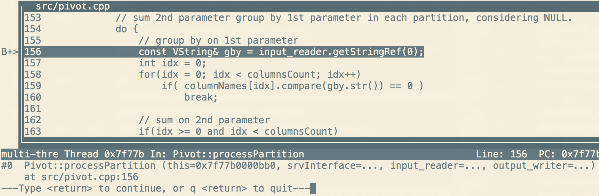
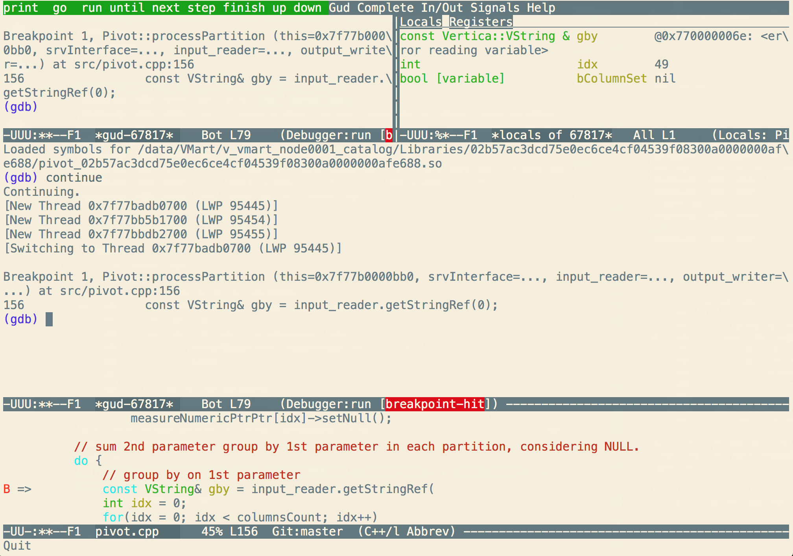
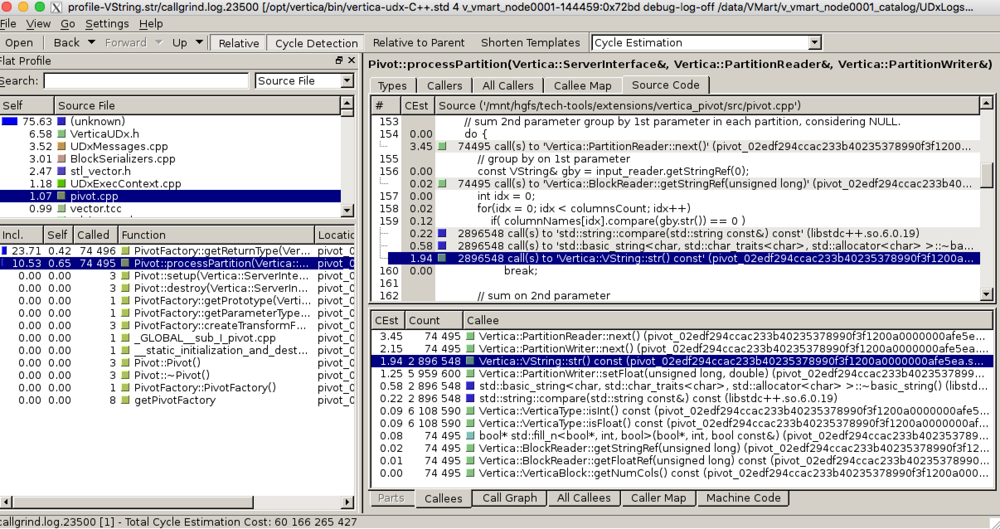
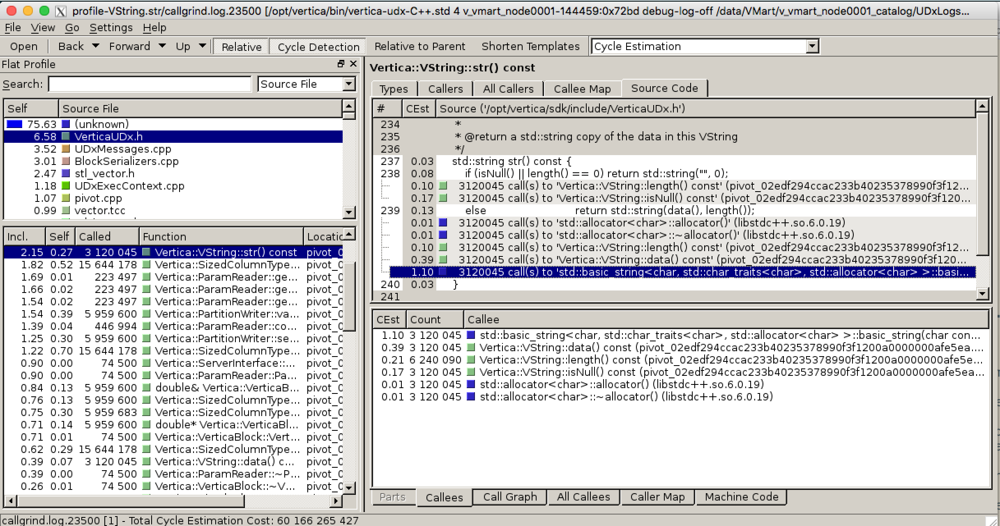
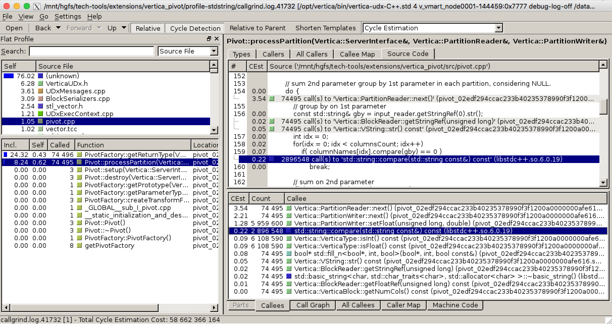
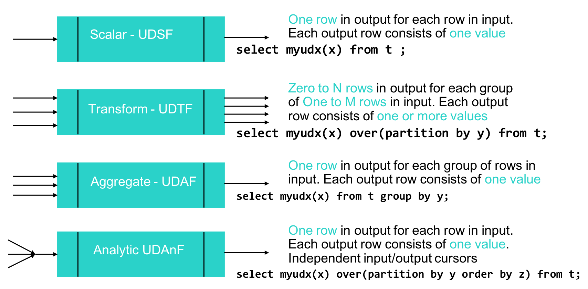

# 如何编写、调试和性能剖析Vertica自定义函数

                          刘定强 2018.05.30

[Click here for English version](how-to-write-debug-and-profile-vertica-udx_en.md) 

在Vertica支撑的分析业务中，有时候需要实现一些比较复杂的处理逻辑。如果用标准SQL来实现，SQL语句可能会写得比较长，并且要查询的数据量本身还很大，这样会导致处理时间会比较长。

这时候，如果使用Vertica的SDK，通过简单的C++/Java/Python/R等语言代码，就可以把一些相对通用的计算逻辑以UDx(User-Defined Extensions, 用户自定义扩展)的形式封装起来，既可以简化SQL、提高性能，又能在多个场合复用这些函数，提高开发效率、提升应用可维护性。

## 编写自定义函数(Coding UDx)

例如，我们做分析报告时，经常需要把本周、当月、甚至更久一段时间中的业务指按天标横向罗列，以方便对比分析。

##### 表1: 各单位销售业绩按日期横向对比分析 <a id="table01"></a>

| 销售中心\销售额\销售日期 | 2003-01-01 | 2003-01-02 | 2003-01-03 | ... |
|:------------------------:|:----------:|:----------:|:----------:|:---:|
| 1 | 1123 | 6014 | 231 | ... |
| 2 | 3053 | 6646 | 3320 | ... |
| 3 | 2732 | 6476 | 3320 | ... |


在关系数据库中，得到上表结果的查询标准SQL写法大致如下：

##### 代码清单1: 标准SQL实现的行转列 <a id="code01"></a>

``` SQL
select call_center_key
  ,sum(decode(d.date, '2003-01-01'::date, sales_dollar_amount)) as "2003-0-01"
  ,sum(decode(d.date, '2003-01-02'::date, sales_dollar_amount)) as ,"2003-01-02"
  sum(decode(d.date, '2003-01-03'::date, sales_dollar_amount)) as "2003-01-03"
  --, ......
from online_sales.online_sales_fact f
  inner join date_dimension d on f.sale_date_key = d.date_key
where d.date >= '2003-01-01' and d.date <= '2003-01-03'
group by call_center_key
order by 1 ;
```

这是比较典型的行转列处理逻辑，需要用SQL的decode函数或case when分支语句来实现行转列，并通过sum函数来分组求和。如果要转换的列比较多，SQL就会比较长，用到的decode/case when和sum函数或表达式就会非常多，SQL书写既复杂、分析大量数据时执行效率也会变差。

如果我们基于Vertica的SDK写一个名叫pivot的自定义函数来实现行转列这个逻辑，上面相同逻辑的SQL就可以改写成：

##### 代码清单2: 基于UDx pivot函数的行转列SQL <a id="code02"></a>

``` SQL
select call_center_key,
   pivot(d.date::varchar, sales_dollar_amount using parameters columnsFilter = '2003-01-01,2003-01-02,2003-01-03', separator = ',') over(partition by call_center_key)
 from online_sales.online_sales_fact f
   inner join date_dimension d on f.sale_date_key = d.date_key
 where d.date >= '2003-01-01' and d.date <= '2003-01-03'
 order by call_center_key;
```

这个行转列的自定义函数是一个Vertica的UDTF(用户自定义转换函数, 详见 [User-Defined Transform Functions](https://my.vertica.com/docs/9.1.x/HTML/index.htm#Authoring/ExtendingVertica/UDx/TransformFunctions/TransformFunctions.htm))。与其他几种标准SQL就有的标量函数、聚合函数、窗口分析函数的扩展不同，UDTF可以把输入的行集转换成任意多行和列的结果，而不只是一个值。

##### 代码清单3: 基于C++ UDTF实现的行转列函数pivot <a id="code03"></a>

```C++
virtual void processPartition(ServerInterface &srvInterface, PartitionReader &input_reader, PartitionWriter &output_writer)
{
    // re-init buffer for sum
    for(int idx = 0; idx < columnsCount; idx++)
            measure[idx] = vfloat_null;

    // sum 2nd parameter group by 1st parameter in each partition, considering NULL.
    do {
        // group by on 1st parameter
        const VString& gby = input_reader.getStringRef(0);
        int idx = 0;
        for(idx = 0; idx < columnsCount; idx++)
            if( columnNames[idx].compare(gby.str()) == 0 )
                break;

        // sum on 2nd parameter
        vfloat value = input_reader.getFloatRef(1);
        if (!vfloatIsNull(value))
        {
            if ( vfloatIsNull(measure[idx]) )
                measure[idx] = value;
            else
                measure[idx] += value;
        }
    } while (input_reader.next());

    // output
    for(int idx = 0; idx < columnsCount; idx++)
        output_writer.setFloat(idx, measure[idx]);
    output_writer.next();
}
```

Vertica的SDK为编写自定义函数提供了足够的抽象，开发人员只需要按它的框架规定填充具体的逻辑就可以了。比如在这个例子里，Vertica的SDK框架会按照的[代码清单2所示调用SQL](#code02)中 **OVER(partition by call\_center\_key)** 子句的声明，把属于相同call\_center\_key的数据推送到processPartition函数中进行转换，不同call\_center\_key的数据会在集群的多个节点、以及节点中的多个线程中并行执行processPartition函数。因此processPartition的实现要能支持多线程可重入和并行执行。

我们要实现的[pivot自定义函数](#code03)在processPartition函数中要实现的行转列逻辑比较简单明了：把SDK传入数据集中每行数据的第一个列作为键值，把键值相同的第二个列的值累加在一起；整个数据集处理完后，把聚合结果写回给SDK。

## 代码调试(Debugging)

要实现的逻辑简单明了，SDK有足够的封装，因此代码写起来很快。编译——>修订语法错误——>再编译，很快这个pivot自定义函数就能通过编译、并连接成共享库，然后就该部署到Vertica中测试了。

部署Vertica自定义函数很简单，执行下面的SQL，就可以完成在集群中安装、定义函数和授权：

##### 代码清单4: 部署UDx <a id="code04"></a>

``` SQL
CREATE LIBRARY pivot AS '/vertica_pivot/.libs/pivot.so';

CREATE TRANSFORM FUNCTION Pivot AS LANGUAGE 'C++' NAME 'PivotFactory' LIBRARY pivot fenced;

GRANT EXECUTE ON TRANSFORM FUNCTION Pivot () to PUBLIC;
```

如果用automake来编译项目的话，上述步骤一般可以把它放到 make 的 install task 里，这里不再赘述。

有效代码虽然短短不足20行，但逻辑错误在所难免。除了通过执行[代码清单2所示SQL](#code02)来观察结果是否正确外，如果真有异常情况应该如何调试呢，比如用gdb？

Vertica的UDx是以共享库(Share Library)的形式与Vertica集成的。所以开始调试的步骤就是(详细步骤见[代码清单5](#code05))：

- 首先打开 **--enable-debug** 选项，在编译时保留调试信息，重新编译连接UDx后把它部署到Vertica中；
- 其次要找到UDx的宿主进程ID；
- 然后用**gdb**附着到这个进程，并先在 **~/.gdbint** (或在gdb里输入)设置参数和断点；
- 另外，通过Vertica的客户端执行测试用例SQL，让gdb触发断点；
- 于是剩下的就是查看堆栈、变量、单步跟踪、设置条件断点等日常调试操作了。

##### 代码清单5: UDx 调试过程 <a id="code05"></a>

```BASH
# compile with debug info, and install UDx
[dbadmin@v001 vertica_pivot]$ make clean && ./configure --enable-debug && make &&  make uninstall && make install

# get process id of Vertica, here it's 66751
[dbadmin@v001 vertica_pivot]$ pidof vertica
66751

# get process id of UDx host which is named vertica-udx-C++ , here it's 67817
[dbadmin@v001 vertica_pivot]$ pstree -apl 66751
vertica,66751 -D /data/VMart/v_vmart_node0001_catalog -C VMart -n v_vmart_node0001 -h 192.168.100.101 -p 5433 -P 4803 -Y ipv4 -c
  ├─vertica-udx-zyg,66815 13 3 66751 debug-log-off /data/VMart/v_vmart_node0001_catalog/UDxLogs 60 14 0
  │   ├─vertica-udx-C++,67817 4 v_vmart_node0001-66751:0x42 debug-log-off /data/VMart/v_vmart_node0001_catalog/UDxLogs 5
  │   │   └─{vertica-udx-C++},67818
  │   ├─{vertica-udx-zyg},66816
  │   └─{vertica-udx-zyg},66817
  ├─{vertica},66813
  ├─{vertica},66814
  ├─{vertica},66818
  ├─{vertica},66819
  ├─{vertica},66820
  ├─{vertica},66861
  ├─{vertica},66862
  ├─{vertica},66863
  ├─{vertica},66945
  └─{vertica},67782

[dbadmin@v001 vertica_pivot]$ cat <<'EOF' > ~/.gdbinit
    set print pretty

    # avoid gdb being interrupted
    handle SIG127 nostop noprint pass

    # follow forked child to avoid "Cannot get thread event message: debugger service failed" 
    set follow-fork-mode child

    # for library in future
    set breakpoint pending on

    break /vertica_pivot/src/pivot.cpp:156
EOF

# attach to UDx host process
[dbadmin@v001 vertica_pivot]$ gdb -tui -p 67817

# followings are debug steps in gdb
...
multi-thre Thread 0x7f77c In: accept                                                                                            Line: ??   PC: 0x7f77c1d6598d 
(no debugging symbols found)...done.
Loaded symbols for /lib64/libcom_err.so.2
Reading symbols from /lib64/ld-linux-x86-64.so.2...(no debugging symbols found)...done.
Loaded symbols for /lib64/ld-linux-x86-64.so.2
0x00007f77c1d6598d in accept ()	from /lib64/libpthread.so.0
Missing separate debuginfos, use: debuginfo-install vertica-9.1.0-1.x86_64
(gdb) bt
#0  0x00007f77c1d6598d in accept () from /lib64/libpthread.so.0
#1  0x0000000000454708 in UDxSideProcess::acceptLoop (this=this@entry=0x7ffc8e3f4390, vertica_sock=vertica_sock@entry=4, 
    sessionID=sessionID@entry=0x7ffc8e3f612d "v_vmart_node0001-66751:0x42", key="dfd9381245aad1d5v_vmart_node0001-66751:0x42c++")
    at /scratch_a/release/svrtar30992/vbuild/vertica/OSS/UDxFence/UDxSideProcess.cpp:131
#2  0x00000000004554ae in UDxSideProcess::go (this=this@entry=0x7ffc8e3f4390, argc=argc@entry=6, argv=argv@entry=0x7ffc8e3f4508)
    at /scratch_a/release/svrtar30992/vbuild/vertica/OSS/UDxFence/UDxSideProcess.cpp:266
#3  0x0000000000406084 in main (argc=6,	argv=0x7ffc8e3f4508) at /scratch_a/release/svrtar30992/vbuild/vertica/OSS/UDxFence/vertica-udx-C++.cpp:1016
(gdb) continue 
Continuing.

# issue query from another terminal through vsql
dbadmin@~(v001:5433) SQL> select call_center_key,
dbadmin@~(v001:5433) ===>    pivot(d.date::varchar, sales_dollar_amount using parameters columnsFilter = '2003-01-01,2003-01-02,2003-01-03', separator = ',') over(partition by call_center_key)
dbadmin@~(v001:5433) ===>  from online_sales.online_sales_fact f
dbadmin@~(v001:5433) ===>    inner join date_dimension d on f.sale_date_key = d.date_key
dbadmin@~(v001:5433) ===>  where d.date >= '2003-01-01' and d.date <= '2003-01-03'
dbadmin@~(v001:5433) ===>  order by call_center_key;

# go back to gdb, it will break at where we want
   ┌──src/pivot.cpp───────────────────────────────────────────┐
   │154 do {                                                  │
   │155     // group by on 1st parameter                      │
B+>│156     const VString& gby = input_reader.getStringRef(0);│
   │157     int idx = 0;                                      │
   │158     for(idx = 0; idx < columnsCount; idx++)           │
   │159         if( columnNames[idx].compare(gby.str()) == 0 )│
   │160             break;                                    │
   │161                                                       │
   │162     // sum on 2nd parameter                           │
   │163     if(idx >= 0 and idx < columnsCount)               │
   └──────────────────────────────────────────────────────────┘
multi-thre Thread 0x7f77b In: Pivot::processPartition                              Line: 156  PC: 0x7f77b9b86ece 
(gdb) bt
#0  Pivot::processPartition (this=0x7f77b0000bb0, srvInterface=..., input_reader=..., output_writer=...)
    at src/pivot.cpp:156
```

在gdb中调试的效果参见[图1](#img01)

##### 图1: gdb调试示意图 <a id="img01"></a>



如果您喜欢用**emacs**写代码，也可以直接在emacs里输入"**M+x ——> gdb ——> gdb -i=mi -p $udxHostPID**“用gdb插件进行调试，可能会更方便些，参见[图2](#img02)。其他如Eclipse CDT、Visual Studio Code等IDE也是不错的选择。

##### 图2: emacs中用gdb调试的示意图 <a id="img02"></a>



经过多轮反复地调试、修改逻辑错误、重新编译部署和测试，自己写的UDx终于能正确工作啦！千百万行数据1秒钟搞定，而且还是在笔记本电脑的虚拟机上，速度还挺快，有点小兴奋😊

于是交付项目使用，大家用得也挺开心。可是没过多久，问题反馈回来了，有点慢！

仔细看查询的SQL，要水平显示近3个多月时间段中每天的数据，而且要查询的数据量高达几十亿行！

##### 代码清单6: 实际使用UDx的查询 <a id="code06"></a>

```SQL
select count(*) from (
select pos_transaction_number, 
  pivot(d.date::varchar, sales_dollar_amount using parameters columnsFilter = '2003-01-01,2003-01-02,2003-01-03,2003-01-04,2003-01-05,2003-01-06,2003-01-07,2003-01-08,2003-01-09,2003-01-10,2003-01-11,2003-01-12,2003-01-13,2003-01-14,2003-01-15,2003-01-16,2003-01-17,2003-01-18,2003-01-19,2003-01-20,2003-01-21,2003-01-22,2003-01-23,2003-01-24,2003-01-25,2003-01-26,2003-01-27,2003-01-28,2003-01-29,2003-01-30,2003-01-31,2003-02-01,2003-02-02,2003-02-03,2003-02-04,2003-02-05,2003-02-06,2003-02-07,2003-02-08,2003-02-09,2003-02-10,2003-02-11,2003-02-12,2003-02-13,2003-02-14,2003-02-15,2003-02-16,2003-02-17,2003-02-18,2003-02-19,2003-02-20,2003-02-21,2003-02-22,2003-02-23,2003-02-24,2003-02-25,2003-02-26,2003-02-27,2003-02-28,2003-03-01,2003-03-02,2003-03-03,2003-03-04,2003-03-05,2003-03-06,2003-03-07,2003-03-08,2003-03-09,2003-03-10,2003-03-11,2003-03-12,2003-03-13,2003-03-14,2003-03-15,2003-03-16,2003-03-17,2003-03-18,2003-03-19,2003-03-20,2003-03-21', separator = ',') over(partition by pos_transaction_number order by d.date)
from online_sales.online_sales_fact f
  inner join date_dimension d on f.sale_date_key = d.date_key
where d.date >= '2003-01-01' and d.date <= '2003-03-21'
order by pos_transaction_number
) t;
```

咋办？性能慢，光靠眼睛看代码、用gdb调试是无济于事的！😨

## 性能剖析(Profiling)

没辙，只能上Profiler了。

适用于C++的性能剖析工具有不少，著名的像gprof、gperftools和Valgrind等。gprof和gperftools对性能影响小，但需要侵入代码、或者链接它们的库，用起来稍微麻烦些；而Valgrind不需要侵入代码，它加载要剖析的目标代码并动态注入剖析指令，这样在目标代码执行的时候就可以收集到详细的内存使用情况、缓存命中情况、代码调用关系和次数、CPU开销等性能指标了，不过缺点就是对性能影响比较大。

好的开发人员一般比较“懒”，喜欢傻瓜式的工具，性能影响大点没关系，咱们只剖析这个UDx又不影响数据库的其他功能，另外可以用千百万行数据模拟出问题就行，没必要一定用全量数据。

可是Valgrind要求加载可执行程序而不是共享库，而我们的UDx是用共享库的方式被Vertica进程加载的，我们又不想剖析整个Vertica进程而影响其他查询的性能。

回忆一下[代码清单5: UDx 调试过程](#code05)中gdb附着UDx宿主进程进行调试的步骤。只要我们能让Valgrind来加载这个名叫 **vertica-udx-C++** 的UDx宿主进程，问题就解决了。

可是vertica-udx-C++是Vertica自带的二进制程序，我们要达到目标，只能“骇客”一下了。方法其实很简单，把vertica-udx-C++改名为 **vertica-udx-C++.std** ，用一个简短的shell脚本替代vertica-udx-C++，从这个shell脚本里用Valgrind来加载改名后真正vertica-udx-C++.std，从而成功地把Valgrind插入到Vertica服务进程与UDx宿主进程vertica-udx-C++之间。

##### 代码清单7: Hacking vertica-udx-C++，植入Valgrind <a id="code07"></a>

```BASH
mv /opt/vertica/bin/vertica-udx-C++ /opt/vertica/bin/vertica-udx-C++.std

cat <<-'EOF' > /opt/vertica/bin/vertica-udx-C++
  #!/bin/sh
  valgrind --tool=callgrind --log-file=/tmp/valgrind.log.%p --callgrind-out-file=/tmp/callgrind.log.%p  /opt/vertica/bin/vertica-udx-C++.std $*
EOF

chmod a+x /opt/vertica/bin/vertica-udx-C++
```

注意：[代码清单7](#code07)中植入的 valgrind 命令行中的 **callgrind-out-file** 参数就是我们希望得到的性能剖析数据路径。

与之前的调试类似，我们需要打开 **--enable-debug** 选项，确保UDx在编译时保留调试信息，重新编译连接UDx后把它部署到Vertica中。然后在Vertica客户端(如vsql)中执行[代码清单6: 实际使用UDx的查询](#code06)，让 Valgrind 收集性能剖析数据。

Valgrind 要求执行的进程结束才会完整写出收集的性能剖析数据。如果发现测试的查询已经执行完，但我们希望得到的性能剖析数据文件却为空，这时候我们需要给 Valgrind 发送一个信号让它结束(参见[代码清单8](#code08))。

##### 代码清单8: 强制 valgrind 结束并写出性能剖析数据 <a id="code08"></a>

 ```BASH
# check whether valgrind is still alive
[dbadmin@v001 vertica_pivot]$ callgrind_control
PID 482347: /opt/vertica/bin/vertica-udx-C++.std 4 v_vmart_node0001-144459:0x5f6b debug-log-off /data/VMart/v_vmart_node0001_catalog/UDxLogs 5

# force valgrind flash out callgrind output
[dbadmin@v001 vertica_pivot]$ callgrind_control | awk '{gsub(":", "", $2); print $2}' | xargs kill
```

然后我们使用 kcachegrind(for Linux) 或 qcachegrind(for macOS) 来打开性能剖析日志，分析UDx的执行时间都主要花在哪些代码上了。

##### 图3: 初始版本的UDx性能剖析数据分析 <a id="img03"></a>




如[图3](#img03)的性能剖析数据分析所示，UDx执行时间消耗排名前4位的代码中，第1、2、4都是Vertica与UDx之间的数据输入和输出，这里没有我们能优化的空间。但排第3位的代码调用了2,896,548次Verti::VString::str()函数，花费预计1.94秒，看起来有点反常，其他等量次数的API调用没有这个高的时间开销。

仔细分析对应的UDx源代码和 kcachegrind 的提示信息，这里有2百多万次的Vertica::VString::str()调用，目的是取这个分组列值进行字符串比较，以获取它在将来转换到的列名称中的顺序号。

点击 kcachegrind 中这一项，还可以看到 Vertica::VString::str() 实现代码，居然每次调用都会创建一个新的字符串，难怪会这么花时间啊！

看来性能问题的根源找到了，优化起来就比较简单了，只需要把这个不变的字符串提到循环外面就可以了。

于是修改代码，重新编译、部署和测试。得到新的性能剖析结果(如[图4](#img04))，第3部分代码的执行时间估计从1.94秒降低到0.22秒了！

##### 图4: 优化后的UDx性能剖析数据分析 <a id="img04"></a>



在上面分析结果中，UDx的大部分执行时间都花在Vertica与UDx之间跨进程的数据输入和输出上了。把优化好的UDx提供给项目使用，由于这个UDx的代码经过了严格的测试，质量比较可靠，我们把这个UDx以非围栏(Not Fence)模式部署，这样它就直接位于Vertica服务进程空间中，不再需要跨进程进行大量数据传递，能节省大量时间。

在实际项目针对几十亿行数据的查询中，仅仅优化这1行代码，性能就提升了高达**4倍**！由此可见代码调试和性能剖析的重要性。

在完成性能剖析工作后，一定要记得把前面“骇客”进去的Valgrind调用去掉，以免影响UDx的性能。步骤很简单，把 Hacking 用的shell脚本丢弃，把原来的vertica-udx-C++文件名称改回来即可(见[代码清单9](#code09)。

##### 代码清单9: 恢复 Hacking 之前的 vertica-udx-C++ <a id="code09"></a>

 ```BASH
# recovery environment
mv /opt/vertica/bin/vertica-udx-C++ /opt/vertica/bin/vertica-udx-C++.valgrind
mv /opt/vertica/bin/vertica-udx-C++.std /opt/vertica/bin/vertica-udx-C++
```

## 附

除了自定义数据加载函数外，Vertica还支持4种不同的UDx，它们的用途和使用方式也有差别：

##### 图5: Vertica 支持的不同UDx类型和用途 <a id="img05"></a>



- UDSF 是自定义标量函数，它与标准SQL里的 abs/substring 等函数类型相似，输入一行数据的一些属性，返回一个值；
- UDAF 是自定义聚合函数，它与标准SQL里的 sum/max 等函数类型相似，输入一个分组的多行数据，返回一个值；
- UDAnF 是自定义窗口分析函数，它与标准SQL里的 row\_num/rank 等函数类型相似，输入一个成组的数据，且为每行输入数据都会返回一个值；
- UDTF 是自定义转换函数，它是Veritca特有的扩展，可以把输入的行集转换成任意多个行和列的结果，而不只是一个值。

除了C++外，Vertica的SDK还支持通过Java、Python和R等语言来编写各种UDx，这些语言编写的UDx在部署、调试和性能剖析等方面都大同小异，只是语言特性和所用的工具链有些不同而已。

