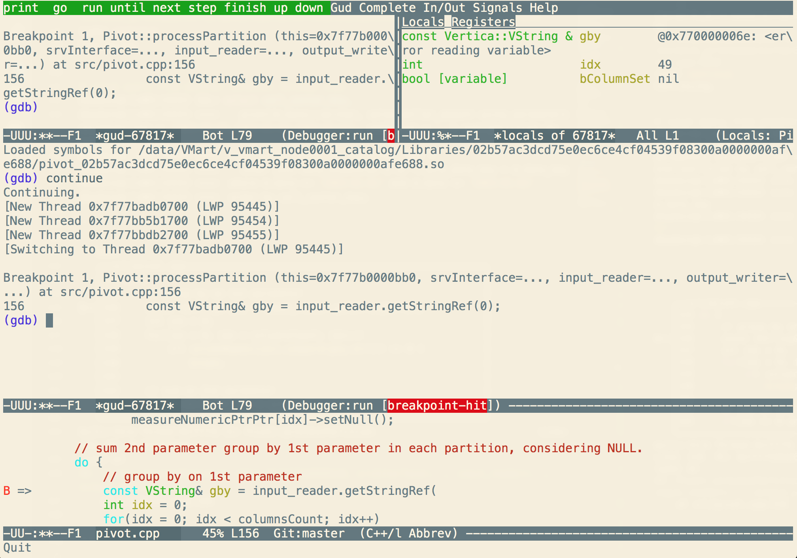
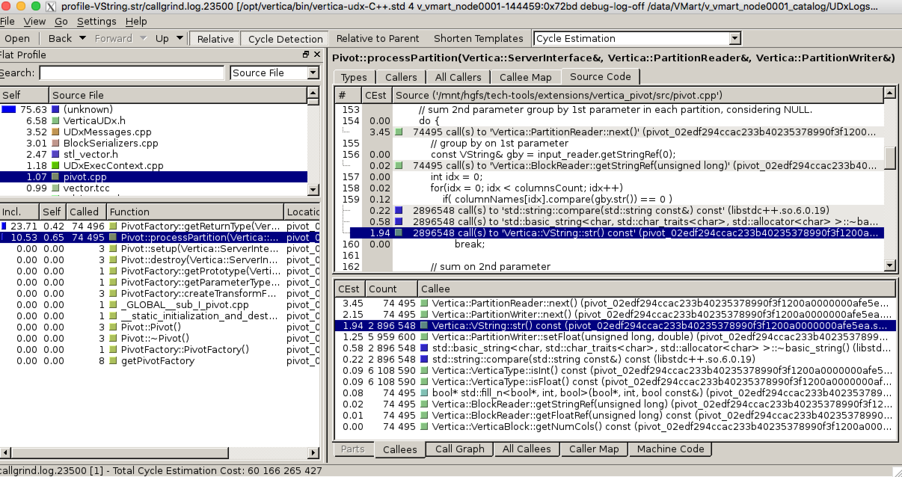
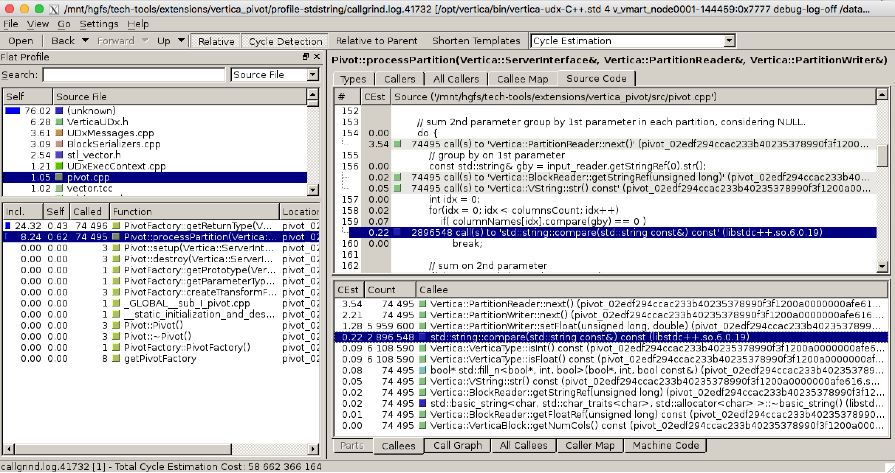
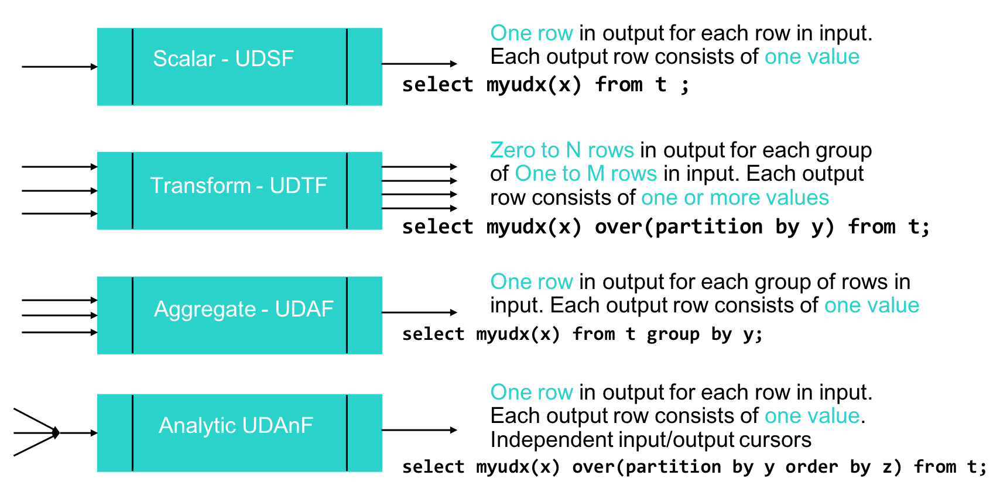

# How to code, debug and profile Vertica UDx

                          DQ 2018.05.30

[点击这里阅读中文版](how-to-write-debug-and-profile-vertica-udx.md) 

In analytic business supported by Vertica, complex processing logic is sometimes unavoidable. Using ANSI SQL maybe cause query string much longer, and with huge volume data to query, which will slow the query.

But with Vertica's SDK, you can encapsulate those general computing logic in the form of UDx (User-Defined Extensions) through simple code such in C++/Java/Python/R language. It can simplify query, improve performance, and reuse these functions in many scenarios to improve development efficiency and improve application maintainability.

## Coding UDx

For example, when we generate analytic reports, we often need to put the daily business indicators for the week, the current month, and even a longer period of time in the horizontal direction according date, to conveniently compare.

##### Table 1: Comparing the Performance of Each Sales Unit by Date <a id="table01"> </a>

Sales unit \ Revenue \ Date | 2003-01-01 | 2003-01-02 | 2003-01-03 | ... |
|:------------------------:|:----------:|:----------:|:----------:|:---:|
| 1 | 1123 | 6014 | 231 | ... |
| 2 | 3053 | 6646 | 3320 | ... |
| 3 | 2732 | 6476 | 3320 | ... |

In RDBMS database, the ANSI SQL for querying the results of the above table looks like follows:

##### Code Listing 1: Rows to Columns in ANSI SQL <a id="code01"> </a>

``` SQL
select call_center_key
  ,sum(decode(d.date, '2003-01-01'::date, sales_dollar_amount)) as "2003-0-01"
  ,sum(decode(d.date, '2003-01-02'::date, sales_dollar_amount)) as ,"2003-01-02"
  sum(decode(d.date, '2003-01-03'::date, sales_dollar_amount)) as "2003-01-03"
  --, ......
from online_sales.online_sales_fact f
  inner join date_dimension d on f.sale_date_key = d.date_key
where d.date >= '2003-01-01' and d.date <= '2003-01-03'
group by call_center_key
order by 1 ;
```

This is a typical rows-to-columns transposing logic that requires the DECODE function or CASE WHEN branching of SQL, and group summing through the SUM function. If there are many columns to be transposed, many DECODE / CASE WHEN, and SUM functions or expressions are required, the SQL will be complicated, and slow down when analyzing huge volumne of data.

If we use the Vertica SDK to code a UDx, named PIVOT, to implement the rows-to-columns transposing logic, the above query can be rewritten as:

##### Code Listing 2: SQL Based on Pivot UDx <a id="code02"> </a>

``` SQL
select call_center_key,
   pivot(d.date::varchar, sales_dollar_amount using parameters columnsFilter = '2003-01-01,2003-01-02,2003-01-03', separator = ',') over(partition by call_center_key)
 from online_sales.online_sales_fact f
   inner join date_dimension d on f.sale_date_key = d.date_key
 where d.date >= '2003-01-01' and d.date <= '2003-01-03'
 order by call_center_key;
```

The PIVOT UDx is a Vertica UDTF (see [User-Defined Transform Functions](https://my.vertica.com/docs/9.1.x/HTML/index.htm#Authoring/ExtendingVertica/UDx/TransformFunctions/TransformFunctions.htm)). Unlike scalar functions, aggregate functions, and analytic functions which similar with ANSI SQL, UDTF can convert the input row set to the result of any number of rows and columns, rather than just a single value.

##### Code Listing 3: Rows-to-Columns transposing UDTF Pivot in C++ <a id="code03"> </a>

```C++
virtual void processPartition(ServerInterface &srvInterface, PartitionReader &input_reader, PartitionWriter &output_writer)
{
    // re-init buffer for sum
    for(int idx = 0; idx < columnsCount; idx++)
            measure[idx] = vfloat_null;

    // sum 2nd parameter group by 1st parameter in each partition, considering NULL.
    do {
        // group by on 1st parameter
        const VString& gby = input_reader.getStringRef(0);
        int idx = 0;
        for(idx = 0; idx < columnsCount; idx++)
            if( columnNames[idx].compare(gby.str()) == 0 )
                break;

        // sum on 2nd parameter
        vfloat value = input_reader.getFloatRef(1);
        if (!vfloatIsNull(value))
        {
            if ( vfloatIsNull(measure[idx]) )
                measure[idx] = value;
            else
                measure[idx] += value;
        }
    } while (input_reader.next());

    // output
    for(int idx = 0; idx < columnsCount; idx++)
        output_writer.setFloat(idx, measure[idx]);
    output_writer.next();
}
```

Vertica's SDK provides sufficient abstraction for coding UDx. Developers only need to fill in the real logic in the place required. For example, in this example, Vertica's SDK will push the rows with same call\_center\_key into the processPartition function according to the declaration of the **OVER(partition by call\_center\_key)** clause in the [Code2 Listing](#code02). Rows with different call\_center\_key will execute processPartition function on different nodes of the cluster, and different threads in a node. Therefore, the processPartition function is required to support multi-thread reentrant and parallel execution.

The [Code Listing 3](#code03) for our PIVOT UDx is simple and straightforward: use the first column of each row of the dataset from the SDK as the key, added the second column with the same key together; after the entire dataset is processed,  write the aggregated result back to the SDK.

## Debugging

With powerful SDK of Vertica, The logic to be implemented looks very straightforward. So the code is finished quickly and compiles ——> correctify syntax error ——> recompile, and soon this UDx can be compiled and linked into a shared library. And then only deploying and testing tasks are left.

Deployment of UDxis very simple in Vertica, execute the following SQL, you can complete the installation in the cluster, define the function and authorization:

##### Code Listing 4: Deploy UDx <a id="code04"> </a>

``` SQL
CREATE LIBRARY pivot AS '/vertica_pivot/.libs/pivot.so';

CREATE TRANSFORM FUNCTION Pivot AS LANGUAGE 'C++' NAME 'PivotFactory' LIBRARY pivot fenced;

GRANT EXECUTE ON TRANSFORM FUNCTION Pivot () to PUBLIC;
```

If you use automake to compile the project, the above steps can be put in the install task of makefile, no overtalk here.

Although code is no more than 20 lines here, but logical mistakes are inevitable. In addition to observing whether the result is correct by executing SQL in [code Listing 2](#code02), how can we debug an code, eg. GDB?

Vertica's UDx is integrated with Vertica in the form of shared libraries (.so). So the process of debugging is (see [Code Listing 5](#code05) for detailed steps):

 - At first, turn on the **--enable-debug** configuration option to keep debug information in target, recompile and link UDx, and deploy it to Vertica;
 - Secondly, find out the host process ID of UDx;
 - Then attach to this process with **gdb** and **~/.gdbint** including parameters and breakpoints required (or type in gdb);
 - In addition, issue testing SQL with the Vertica client, eg. vsql, let gdb trigger breakpoints;
 - So the rest tasks are checking the stack, variables, conditional breakpoints, step,  and other normal debugging operations.

##### Code Listing 5: UDx Debugging Process <a id="code05"> </a>

```BASH
# compile with debug info, and install UDx
[dbadmin@v001 vertica_pivot]$ make clean && ./configure --enable-debug && make &&  make uninstall && make install

# get process id of Vertica, here it's 66751
[dbadmin@v001 vertica_pivot]$ pidof vertica
66751

# get process id of UDx host which is named vertica-udx-C++ , here it's 67817
[dbadmin@v001 vertica_pivot]$ pstree -apl 66751
vertica,66751 -D /data/VMart/v_vmart_node0001_catalog -C VMart -n v_vmart_node0001 -h 192.168.100.101 -p 5433 -P 4803 -Y ipv4 -c
  ├─vertica-udx-zyg,66815 13 3 66751 debug-log-off /data/VMart/v_vmart_node0001_catalog/UDxLogs 60 14 0
  │   ├─vertica-udx-C++,67817 4 v_vmart_node0001-66751:0x42 debug-log-off /data/VMart/v_vmart_node0001_catalog/UDxLogs 5
  │   │   └─{vertica-udx-C++},67818
  │   ├─{vertica-udx-zyg},66816
  │   └─{vertica-udx-zyg},66817
  ├─{vertica},66813
  ├─{vertica},66814
  ├─{vertica},66818
  ├─{vertica},66819
  ├─{vertica},66820
  ├─{vertica},66861
  ├─{vertica},66862
  ├─{vertica},66863
  ├─{vertica},66945
  └─{vertica},67782

[dbadmin@v001 vertica_pivot]$ cat <<'EOF' > ~/.gdbinit
    set print pretty

    # avoid gdb being interrupted
    handle SIG127 nostop noprint pass

    # follow forked child to avoid "Cannot get thread event message: debugger service failed" 
    set follow-fork-mode child

    # for library in future
    set breakpoint pending on

    break /vertica_pivot/src/pivot.cpp:156
EOF

# attach to UDx host process
[dbadmin@v001 vertica_pivot]$ gdb -tui -p 67817

# followings are debug steps in gdb
...
multi-thre Thread 0x7f77c In: accept                                                                                            Line: ??   PC: 0x7f77c1d6598d 
(no debugging symbols found)...done.
Loaded symbols for /lib64/libcom_err.so.2
Reading symbols from /lib64/ld-linux-x86-64.so.2...(no debugging symbols found)...done.
Loaded symbols for /lib64/ld-linux-x86-64.so.2
0x00007f77c1d6598d in accept ()	from /lib64/libpthread.so.0
Missing separate debuginfos, use: debuginfo-install vertica-9.1.0-1.x86_64
(gdb) bt
#0  0x00007f77c1d6598d in accept () from /lib64/libpthread.so.0
#1  0x0000000000454708 in UDxSideProcess::acceptLoop (this=this@entry=0x7ffc8e3f4390, vertica_sock=vertica_sock@entry=4, 
    sessionID=sessionID@entry=0x7ffc8e3f612d "v_vmart_node0001-66751:0x42", key="dfd9381245aad1d5v_vmart_node0001-66751:0x42c++")
    at /scratch_a/release/svrtar30992/vbuild/vertica/OSS/UDxFence/UDxSideProcess.cpp:131
#2  0x00000000004554ae in UDxSideProcess::go (this=this@entry=0x7ffc8e3f4390, argc=argc@entry=6, argv=argv@entry=0x7ffc8e3f4508)
    at /scratch_a/release/svrtar30992/vbuild/vertica/OSS/UDxFence/UDxSideProcess.cpp:266
#3  0x0000000000406084 in main (argc=6,	argv=0x7ffc8e3f4508) at /scratch_a/release/svrtar30992/vbuild/vertica/OSS/UDxFence/vertica-udx-C++.cpp:1016
(gdb) continue 
Continuing.

# issue query from another terminal through vsql
dbadmin@~(v001:5433) SQL> select call_center_key,
dbadmin@~(v001:5433) ===>    pivot(d.date::varchar, sales_dollar_amount using parameters columnsFilter = '2003-01-01,2003-01-02,2003-01-03', separator = ',') over(partition by call_center_key)
dbadmin@~(v001:5433) ===>  from online_sales.online_sales_fact f
dbadmin@~(v001:5433) ===>    inner join date_dimension d on f.sale_date_key = d.date_key
dbadmin@~(v001:5433) ===>  where d.date >= '2003-01-01' and d.date <= '2003-01-03'
dbadmin@~(v001:5433) ===>  order by call_center_key;

# go back to gdb, it will break at where we want
   ┌──src/pivot.cpp───────────────────────────────────────────┐
   │154 do {                                                  │
   │155     // group by on 1st parameter                      │
B+>│156     const VString& gby = input_reader.getStringRef(0);│
   │157     int idx = 0;                                      │
   │158     for(idx = 0; idx < columnsCount; idx++)           │
   │159         if( columnNames[idx].compare(gby.str()) == 0 )│
   │160             break;                                    │
   │161                                                       │
   │162     // sum on 2nd parameter                           │
   │163     if(idx >= 0 and idx < columnsCount)               │
   └──────────────────────────────────────────────────────────┘
multi-thre Thread 0x7f77b In: Pivot::processPartition                              Line: 156  PC: 0x7f77b9b86ece 
(gdb) bt
#0  Pivot::processPartition (this=0x7f77b0000bb0, srvInterface=..., input_reader=..., output_writer=...)
    at src/pivot.cpp:156
```


The effect of debugging in gdb, see [Figure 1](#img01)

##### Figure 1: Debug wth gdb <a id="img01"></a>


If you prefer to use *emacs* to write code, you can also type "**M+x ——> gdb ——> gdb -i=mi -p $udxHostPID**" directly in emacs. Debugging in emacs with gdb plugin may be more convenient, see [Figure 2](#img02). Other IDEs such as Eclipse CDT, Visual Studio Code are also good choices.

##### Figure 2: Debugging in Emacs <a id="img02"></a>



After rounds of debugging, modifying logic errors, recompiling, deployment and testing, the UDx worked well finally! Millions rows of data are processed in 1 second, just on the laptop, quite fast and a little excitement😊.

Then it was delivered for using in the whole project, everyone was happy with it. However, it didn't take long for a request coming back. It was a bit slow!

Look into the query, it will show the data of nearly 3 months time period by date horizontally, and the volume of data to be queried up to several billion rows!

##### Code Listing 6: Actual UDx query <a id="code06"></a>

```SQL
select count(*) from (
select pos_transaction_number, 
  pivot(d.date::varchar, sales_dollar_amount using parameters columnsFilter = '2003-01-01,2003-01-02,2003-01-03,2003-01-04,2003-01-05,2003-01-06,2003-01-07,2003-01-08,2003-01-09,2003-01-10,2003-01-11,2003-01-12,2003-01-13,2003-01-14,2003-01-15,2003-01-16,2003-01-17,2003-01-18,2003-01-19,2003-01-20,2003-01-21,2003-01-22,2003-01-23,2003-01-24,2003-01-25,2003-01-26,2003-01-27,2003-01-28,2003-01-29,2003-01-30,2003-01-31,2003-02-01,2003-02-02,2003-02-03,2003-02-04,2003-02-05,2003-02-06,2003-02-07,2003-02-08,2003-02-09,2003-02-10,2003-02-11,2003-02-12,2003-02-13,2003-02-14,2003-02-15,2003-02-16,2003-02-17,2003-02-18,2003-02-19,2003-02-20,2003-02-21,2003-02-22,2003-02-23,2003-02-24,2003-02-25,2003-02-26,2003-02-27,2003-02-28,2003-03-01,2003-03-02,2003-03-03,2003-03-04,2003-03-05,2003-03-06,2003-03-07,2003-03-08,2003-03-09,2003-03-10,2003-03-11,2003-03-12,2003-03-13,2003-03-14,2003-03-15,2003-03-16,2003-03-17,2003-03-18,2003-03-19,2003-03-20,2003-03-21', separator = ',') over(partition by pos_transaction_number order by d.date)
from online_sales.online_sales_fact f
  inner join date_dimension d on f.sale_date_key = d.date_key
where d.date >= '2003-01-01' and d.date <= '2003-03-21'
order by pos_transaction_number
) t;
```

Code reviewing and debugging are helpless for performance! What can we do?😨

## Profiling

Nothing but Profiler now.

There are a lot of profiling tools available for C++, such as gprof, gperftools, and Valgrind. Gprof and gperftools have little impact on performance, but require code intrusion, or links to their libraries, they are a little cumbersome to use. Valgrind is non-intrusive. It loads the object code to be profiled and dynamically injects profiling instructions so that detailed memory usage, cache hits, code call graph and CPU cycles can be collected when the object code is executed. But the disadvantage is performance impact.

Good developers are generally "lazy", and prefer smart & powerful tools. Performance impact does not matter much, as we only profile this UDX, not the whole database. And millions rows of data can be used to simulate the problem, not the whole huge volumn of data.

However, Valgrind requires loading executable programe instead of shared library, and our UDx is loaded by the Vertica process as a shared library. We do not want to profile the entire Vertica process to affect the performance of other queries.

Recall that gdb attaches to the UDx host process for debugging in [Code Listing 5](#code05). To make profiling work, we just need Valgrind load the UDx host process named **vertica-udx-C++**.

But vertica-udx-C++ is a binary program provided by Vertia. We have to "hack" it for our goal. The method is actually very simple, rename vertica-udx-C++ to **vertica-udx-C++.std**, replace vertica-udx-C++ with a short shell script, and use Valgrind to load the renamed udx-C++.std in this shell script, which successfully inserts Valgrind between the Vertica service process and the UDx host process.

##### Code Listing 7: Hacking vertica-udx-C++, Injects Valgrind <a id="code07"></a>

```BASH
mv /opt/vertica/bin/vertica-udx-C++ /opt/vertica/bin/vertica-udx-C++.std

cat <<-'EOF' > /opt/vertica/bin/vertica-udx-C++
  #!/bin/sh
  valgrind --tool=callgrind --log-file=/tmp/valgrind.log.%p --callgrind-out-file=/tmp/callgrind.log.%p  /opt/vertica/bin/vertica-udx-C++.std $*
EOF

chmod a+x /opt/vertica/bin/vertica-udx-C++
```

Note: The **callgrind-out-file** parameter on the valgrind command line embedded in [Code Listing 7](#code07) is the path for our desired profile data.

Similar to debugging, we need to turn on the **--enable-debug** configuration option to ensure that UDx retains debugging information at compile time, recompile & linke the UDx, and deploy it to Vertica. Then execute SQL from [Code Listing 6](#code06) in the Vertica client (such as vsql) to have Valgrind collect profile data.

Valgrind requires the profiling process completed to write out all the collected data. If we find the expected profile data file is empty when the testing query has finished, we need to send a signal to Valgrind to make it end (see [Code Listing 8](#code08)).

##### Code Listing 8: Force valgrind to end and write out profile data <a id="code08"></a>

 ```BASH
# check whether valgrind is still alive
[dbadmin@v001 vertica_pivot]$ callgrind_control
PID 482347: /opt/vertica/bin/vertica-udx-C++.std 4 v_vmart_node0001-144459:0x5f6b debug-log-off /data/VMart/v_vmart_node0001_catalog/UDxLogs 5

# force valgrind flash out callgrind output
[dbadmin@v001 vertica_pivot]$ callgrind_control | awk '{gsub(":", "", $2); print $2}' | xargs kill
```

Then we can use kcachegrind(for Linux) or qcachegrind(for macOS) to open the profiling logs and find out which parts of UDx code the execution time is mainly spent on.

##### Figure 3: Original version of UDx profile data analysis <a id="img03"></a>




As shown in [Figure 3](#img03) profile data analysis, in the top 4 places ranked by UDx execution time consumption, the 1st, 2nd, and 4th are the data input and output between Vertica and UDx, there is no optimize Space to us. However, the 3rd place calls 2,896,548 times of Verti::VString::str() function. It takes an estimated 1.94 seconds. It's a little weird, as other similar number of API calls do not consume so much time.

When looking into related UDx source code and kcachegrind prompts, there are more than 2 million Vertica::VString::str() call, the purpose is to comare the grouping column value against the target columns name list to get its sequence number.

Click on this item in the kcachegrind, you can also see the Vertica::VString::str() code, actually it create a new string for each call, no wonder it will take so much time!

It seems that we've got the root cause. Optimizing it is simple, just moving this constant string outside the loop.

Then modify the code, recompile, deploy and test. Get a new profile data (see [Figure 4](#img04)), the estimate execution time of the 3rd place reduce from 1.94 seconds to 0.22 seconds!

##### Figure 4: Optimized version of UDx profile analysis <a id="img04"></a>



Accoridng to the above analysis results, most of the UDx's execution time is spent on cross-process data input and output between Vertica and UDx. Because the code of this UDx has been rigorously tested and the quality is reliable, we deployed this optimized UDx in a non-fence mode, so that it is located directly in the Vertica service process space. It can save a lot of time without transfering huge volume of data across processes.

In the actual project with query on billions rows of data, just optimize this one line of code, the performance was increased up to **4 times**! This story proved the importance of code debugging and profiling.

After completing the profiling work, we should remember to remove the Valgrind command in the hacking code to avoid performance impacting of the UDx. The steps are very simple. Discard the hacking shell script and change the name of the original vertica-udx-C++ file back (see [Code Listing 9](#code09).

##### Code Listing 9: Recover Vertica-udx-C++ to state <a id="code09"></a>

 ```BASH
# recovery environment
mv /opt/vertica/bin/vertica-udx-C++ /opt/vertica/bin/vertica-udx-C++.valgrind
mv /opt/vertica/bin/vertica-udx-C++.std /opt/vertica/bin/vertica-udx-C++
```

## Appendix

In addition to User-Defined loading functions, Vertica also supports four different types of UDxs, which have different usages :

##### Figure 5: Different types of UDx and usages supported by Vertica <a id="img05"></a>



- UDSF means User-Defined Scalar Function. It is similar to the functions such as abs/substring in ANSI SQL. It inputs some attributes of a row and returns a value;
- UDAF means User-Defined Aggregate Function. It is similar to the function such as sum/max in ANSI SQL. It inputs a group of rows and returns a value.
- UDAnF means a User-Defined Analytic Function. It is similar to function such as row\_\num/rank in ANSI SQL. Input a group of rows, and return a value for each inut row;
- UDTF means User-Defined Transform Function, which is a Veritca-specific extension that can convert the input rowset into the results of any number of rows and columns, rather than just a single value.

In addition to C++, the Vertica SDK also supports coding UDx in languages such as Java, Python, and R. UDx written in these languages are similar on deployment, debugging, and profiling.

