# 对象存储开源实现 Minio 和 Vertica 存储计算分离模式高性价比方案

```text
                            刘定强 2019.10.01
```

传统上我们使用``基于块``的存储和``文件系统``。基于块的文件系统使用查找表来存储文件位置，它们将每个文件分成小块(通常大小为 4KB)，并将每个块的字节偏移量存储在一个大表中。 这更适合较小的数据集。但当数据量要扩展到 PB 级时，这些查找表将变得非常大，面临严重的可扩展性问题。

然而，我们现在正经历着数据的爆炸式增长，稍微有一定规模的企业，其数据容量都超过数 10 PBs，而且数据产生的速度还在不断增加。这意味着随着时间的推移，这个问题只会变得更严重。

为了解决这个问题，一些组织已经部署了可横向扩展的文件系统，例如 HDFS。 这一定程度上解决了可扩展性问题，但这类文件系统大多数都依赖于复制来保护数据。通常需要保存 3 个副本才能保证足够的可靠性。10 PBs 级的数据通常需要大量的磁盘和服务器设备，总体成本比较高。

``对象存储``为访问时延无极端苛刻要求的海量数据文件存储提供了一个高吞吐量、高可扩展、低成本的方案。对象存储将数据本身与元数据标记和唯一标识符绑定在一起，存储在扁平的地址空间中，从而更容易跨区域查找和检索数据，而且还有助于提高可扩展性。对象存储可以在单个命名空间中扩展到 10~100 PBs。 对象存储不使用数据复制，而是使用 [纠删码](#存储系统和纠删码原理) 等技术来保护数据、最大化可用的磁盘空间，从而降低成本。

|            | 对象存储              | (基于块的)文件存储                   |
|:----------:|:--------------------:|:---------------------------------:|
| ``性能``    | 大数据量和高流吞吐量要求场景性能最佳 | 更适合小数据量随机访问     |
| ``地理分布`` | 数据可以跨多个区域存储  | 数据通常在本地共享                   |
| ``可扩展性`` | 轻松扩展到 10 PBs 以上 | 可能扩展到数百万个文件，容量很难达到 PB |

## 存储系统和纠删码原理

假定每个磁盘包含一个 w 位(bit)宽的字，标记这些字为 d0, ..., dk-1，这些字存储在数据磁盘；用 c0, ..., cm-1 来表示编码字，它们存储在编码磁盘上。共计需要 n=k+m 块磁盘。编码字可定义为数据字的线性组合：

```math
c0   = a(  0,0)d0 + …+ a(  0,k−1)dk−1
c1   = a(  1,0)d0 + …+ a(  1,k−1)dk−1
…
…
cm−1 = a(m−1,0)d0 + …+ a(m−1,k−1)dk−1
```

系数 a(i,j) 也是 w 位宽的字。因此，编码只需要对这些字进行乘法和加法运算，而解码会涉及用高斯消元法或矩阵逆运算求解线性方程组。因此，纠删码就由字宽 w 和系数 a(i,j) 来定义。

当某些数据字因为某种原因丢失后，可以根据存活的数据和编码字进行逆运算，解码重构原来的这些数据字，从而实现数据保护。

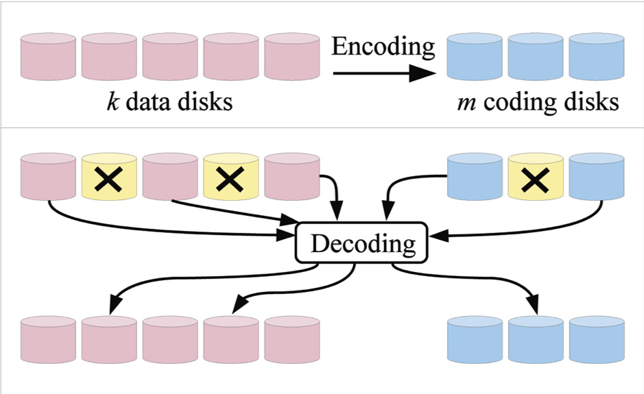

在实际存储中，磁盘被划分成被称为``条块(strip)``的较大单元。把多个条块构成被称为``条带(stripe)``的独立实体用于纠删码编码、解码操作，它使得存储系统设计具有灵活性。例如，采用不同方式让许多这样的条带在多块磁盘间均衡分布。

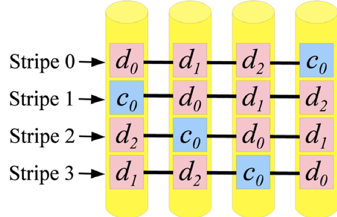
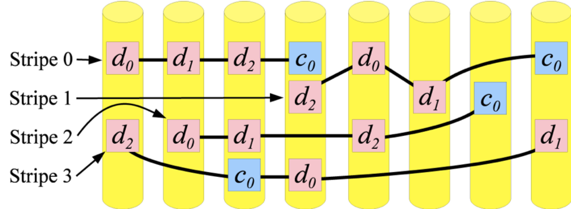

简单的纠删码其实已经广泛应用于存储系统中。比如：

- RAID-5 就是 m=1, w=1, a=1:

  ```math
  p = d0 ⊕ d1 ⊕ … ⊕ dk−1
  ```

  这里的加法计算就是异或(XOR)计算。当某一位丢失，就可以根据幸存的其它位通过异或计算解码出来。

- RAID-6 就是 m=2, w=8。与 RAID-5 相似，但额外多了个编码q，可以容错2份数据丢失：
  
  ```math
  p = d0 ⊕   d1  ⊕ … ⊕ dk−1
  q = d0 ⊕ 2(d1) ⊕ … ⊕ 2^k-1(dk−1)
  ```

``里(德)-所(罗门)码``(Reed-Solomon Codes) 是一种比较通用的纠删码，它的特点是只要满足 n <= 2^w，对任意的 k 和 m 都很容易找到成立的 a。下面通过一个形象的例子来说明。

例如一个 w=8, k=4, m=2 的里-所码系统，数据文件被分割成4块，会增加2块额外的校验数据。如果我们的数据文件内容是“ABCDEFGHIJKLMNOP”，它们看起来像这样：

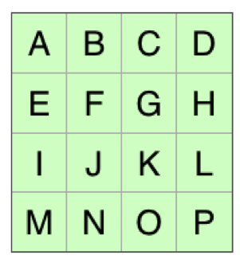

在这里，文件分成的 4 块各有 4 个字节长。每块是矩阵的一行。第一个是"ABCD"。第二个是"EFGH"，以此类推。

里里-所码算法会创建一个编码矩阵，将该矩阵与数据矩阵相乘就可以得到编码数据。矩阵被精心设计使得结果的前四行与输入的前四行相同。数据保持不变意味着它实际做的是校验工作。结果矩阵中比原始数据矩阵多出来的两行就是校验码部分。

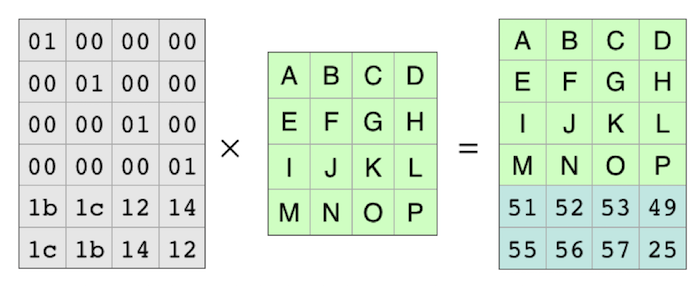

由于编码矩阵的每一行都会生成一行结果，因此编码矩阵的每一行都生成了文件的一个结果片段。由于行是独立的，因此可以划掉两行，而方程仍然成立。

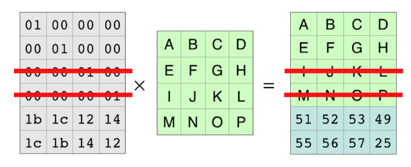

把这些丢失的行去掉后，方程简化如下图所示：

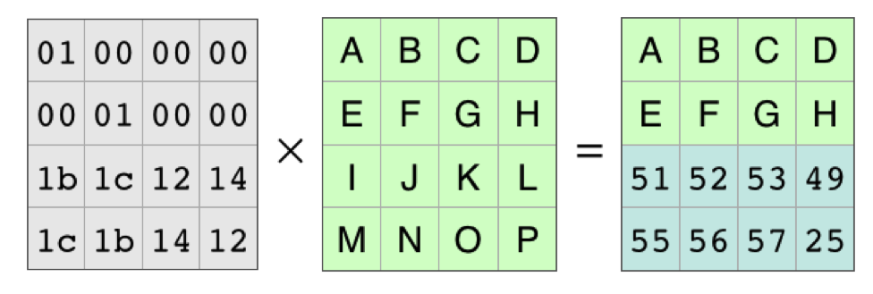

左边的编码矩阵是可逆的。我们在方程两边都左乘编码矩阵的逆矩阵：

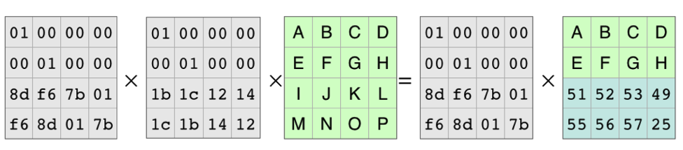

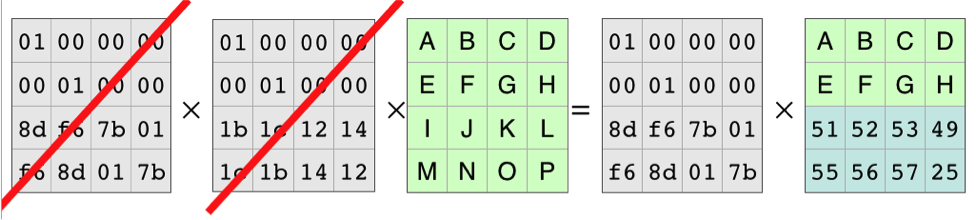

简化后就得到从存活原始数据块和校验码块中重建丢失原始数据的解码方程：

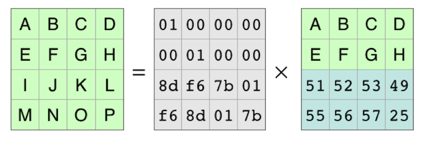

因此，得到解码矩阵的过程就是，去掉原始编码矩阵中与丢失数据对应的行，求出它的逆矩阵。然后，将这个解码矩阵和可用于重建原始数据的块相乘，就得到丢失的原始数据块。

[Backblaze](https://www.backblaze.com) 采用 Java 语言实现了里-所码，并开源为 [JavaReedSolomon](https://github.com/Backblaze/JavaReedSolomon) 。Backblaze通过里-所码(w=8, n=20, k=17, m=3)[提供 8~11 个 9 的高可用，支撑了超过 ZB(1024 PB) 的用户数据](https://www.backblaze.com/blog/vault-cloud-storage-architecture/)。

## Minio 简介

Mino 是基于 Apache License v2.0 协议完全[开源](https://github.com/minio/minio)、兼容 Amazon S3 API、高性能、可扩展、低成本的对象存储软件，并提供包括故障诊断、安全更新和bug修复、7x24小时支持等在内的[订阅服务](https://min.io/subscription)。

### Minio 的架构

Minio 采用分布式的架构，把数据分片、并和纠删码编码后的校验数据分片一起均匀存储到多个服务器上的 JBOD(just a bunch of disks) 磁盘中，不需要磁盘RAID。在存储和读取对象数据的同时存储和读取校验Hash值，自动纠正服务器或磁盘故障、静默数据坏块。

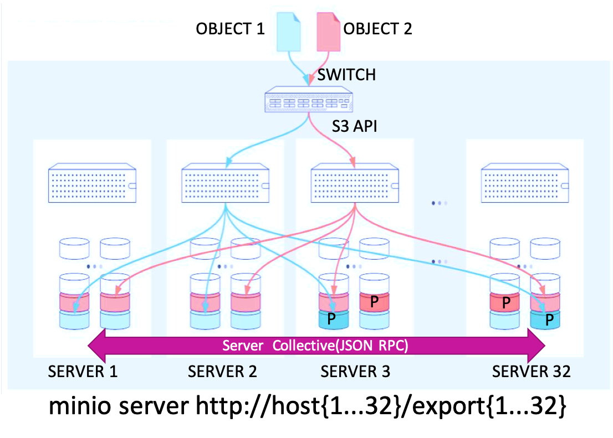

为了保证分布式存储的性能，Mino 把每 n(受环境变量 MINIO_ERASURE_SET_DRIVE_COUNT 控制，必须是 4~16 之间的偶数，缺省取尽可能大的值)块磁盘构成一个[纠删组](https://github.com/minio/minio/blob/RELEASE.2019-09-18T21-55-05Z/docs/distributed/DESIGN.md#architecture)(相当于stripe)。对象的原始数据和校验数据被分片后存储在每个纠删组的各个磁盘上与对象同名的目录中(下图中的part.n)，并附上对象的元数据(下图中的xl.json)。第一块数据磁盘序号由对象名称的 Hash 值确定，这样就可以把多个对象的原始数据分片均匀分布在所有磁盘上，从而均衡地利用所有磁盘的读写能力和容量。

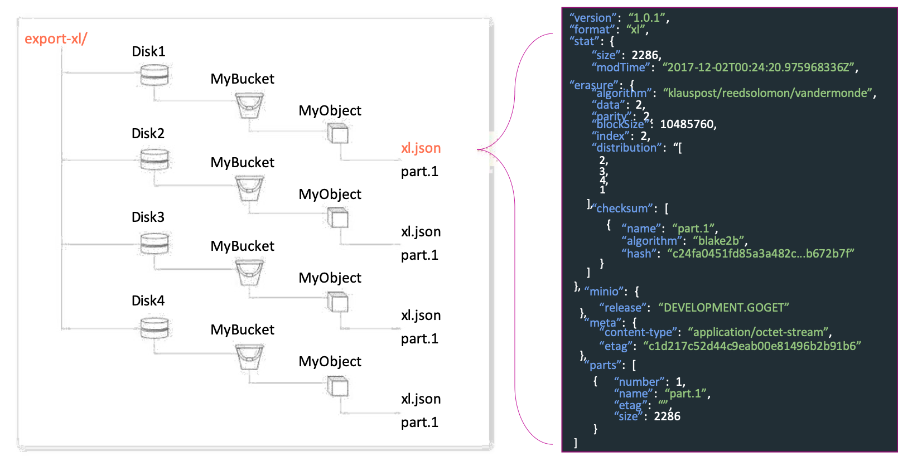

Minio 主要有以下特点：

- 纠删码分布式对象存储
  - 缺省数据分片和编码分片数相同，即 k=m，磁盘占比为 2.00(低于 HDFS 的 3.00)，能容错 50% 的服务器故障
  - 可以设置全局或对象级的数据和校验分片数，2 <= m <= n/2，磁盘占比在 1.14~2.00 之间
- SHA-512 Hash 检测静默数据坏块
- 针对 x64 和 ARM CPU 的 SIMD 指令优化
- 兼容AWS S3 API
  - 还提供“先写后读”的严格一致性
- 作为其他存储的 S3 协议网关
  - AWS/GCS/Azure/OSS
  - HDFS/NAS
- 扩展能力
  - 单个 namespace 最多 32 个节点
  - 但可多个 namespace 联邦

### Minio 的核心代码解读

下面概览一下 Minio 的纠删码、对象存储API、数据分布机制等核心代码。如果您对具体代码不感兴趣，可以直接跳到"[Minio 的性能指标](#Minio-的性能指标)"章节。

#### 纠删码

Minio 采用了与 Backblaze 一样的里-所纠删码算法，但用的是 Go 语言实现的 [klauspost/reedsolomon](https://github.com/klauspost/reedsolomon) 版本。它同样开源，可达到超过 1GB/s/cpu core 的吞吐能力。

```Go
import (
    "github.com/klauspost/reedsolomon"
)

// Erasure - erasure encoding details.
type Erasure struct {
    encoder                  reedsolomon.Encoder
    dataBlocks, parityBlocks int
    blockSize                int64
}

// NewErasure creates a new ErasureStorage.
func NewErasure(ctx context.Context, dataBlocks, parityBlocks int, blockSize int64) (e Erasure, err error) {
    e = Erasure{dataBlocks: dataBlocks, parityBlocks: parityBlocks, blockSize: blockSize}
    e.encoder, err = reedsolomon.New(dataBlocks, parityBlocks)
}

// Encode reads from the reader, erasure-encodes the data and writes to the writers.
func (e *Erasure) Encode(ctx context.Context, src io.Reader, writers []io.Writer, quorum int) (total int64) {
    writer := &parallelWriter{ writers: writers, writeQuorum: quorum }

    for buf := range io.ReadFull(src) {
        blocks, _ := e.encoder.Split(data)
        e.encoder.Encode(blocks)

        writer.Write(ctx, blocks)
        total += len(blocks)
    }
    return total
}

// Decode reads from readers, reconstructs data if needed and writes the data to the writer.
func (e Erasure) Decode(ctx context.Context, writer io.Writer, readers []io.ReaderAt) {
    reader := newParallelReader(readers)

    for bufs := range reader.Read() {
        needsReconstruction := false
        for _, b := range bufs[:e.dataBlocks] {
            if b == nil {
                needsReconstruction = true
                break
            }
        }
        if needsReconstruction {
            e.encoder.ReconstructData(bufs)
        }

        writeDataBlocks(ctx, writer, bufs, e.dataBlocks)
    }
}
```

Mino 的纠删码只是把 klauspost/reedsolomon 提供的数据分片、编码、重构数据等 API 简单封装了一下。但在读数据的时候如果遇到服务器或磁盘故障异常，它会自动用校验数据来解码纠正数据。

在编码/解码进行读取/保存磁盘时候，Minio 采用了多 Goroutines(相当于线程) 并行读写机制来提升性能。

#### 对象存储API

Minio 的对象存储 API 中使用了细粒度(对象)的分布式锁，能够提供先写(PutObject)后读(GetObject/ListObject)的强一致性。

```Go
// PutObject - creates an object upon reading from the input stream
// until EOF, erasure codes the data across all disk and additionally
// writes `xl.json` which carries the necessary metadata for future
// object operations.
func (xl xlObjects) PutObject(ctx context.Context, bucket string, object string, r *PutObjReader) error {
    // Lock the object.
    objectLock := xl.nsMutex.NewNSLock(ctx, bucket, object)
    objectLock.GetLock(globalObjectTimeout)
    defer objectLock.Unlock()

    data := r.Reader

    // Get parity and data drive count based on storage class metadata
    dataDrives, parityDrives := getRedundancyCount(len(xl.getDisks()))

    // we now know the number of blocks this object needs for data and parity.
    writeQuorum := dataDrives + 1

    // Initialize parts metadata.
    partsMetadata := make([]xlMetaV1, len(xl.getDisks()))
    // xlMeta.Erasure.Distribution = hashOrder(object, dataBlocks+parityBlocks)
    xlMeta := newXLMetaV1(object, dataDrives, parityDrives)
    // Initialize xl meta.
    for index := range partsMetadata {
        partsMetadata[index] = xlMeta
    }

    // Order disks according to erasure distribution
    onlineDisks := shuffleDisks(xl.getDisks(), xlMeta.Erasure.Distribution)

    erasure, _ := NewErasure(ctx, xlMeta.Erasure.DataBlocks, xlMeta.Erasure.ParityBlocks, xlMeta.Erasure.BlockSize)

    writers := make([]io.Writer, len(onlineDisks))
    for i, disk := range onlineDisks {
        if disk != nil {
            writers[i] = newBitrotWriter(disk, erasure.ShardFileSize(data.Size()), DefaultBitrotAlgorithm, erasure.ShardSize())
        }
    }

    n := erasure.Encode(ctx, data, writers, writeQuorum)
    closeBitrotWriters(writers)

    // Should return IncompleteBody{} error when reader has fewer bytes
    // than specified in request header.
    if n < data.Size() {
        return IncompleteBody
    }

    // Save additional erasureMetadata.
    // Write unique `xl.json` for each disk.
    writeUniqueXLMetadata(ctx, onlineDisks, uniqueID, partsMetadata, writeQuorum)
}

// GetObject - reads an object erasured coded across multiple disks.
//
func (xl xlObjects) GetObject(ctx context.Context, bucket, object string, writer io.Writer) {
    // Lock the object before reading.
    objectLock := xl.nsMutex.NewNSLock(ctx, bucket, object)
    objectLock.GetRLock(globalObjectTimeout)
    defer objectLock.RUnlock()

    // Read metadata associated with the object from all disks.
    metaArr, _ := readAllXLMetadata(ctx, xl.getDisks(), bucket, object)

    // get Quorum for this object
    readQuorum  := metaArr.Erasure.DataBlocks

    // Pick latest valid metadata.
    xlMeta, _ := pickValidXLMeta(ctx, metaArr, modTime, readQuorum)

    // Reorder online disks based on erasure distribution order.
    onlineDisks = shuffleDisks(onlineDisks, xlMeta.Erasure.Distribution)

    // Reorder parts metadata based on erasure distribution order.
    metaArr = shufflePartsMetadata(metaArr, xlMeta.Erasure.Distribution)

    erasure, _ := NewErasure(ctx, xlMeta.Erasure.DataBlocks, xlMeta.Erasure.ParityBlocks, xlMeta.Erasure.BlockSize)

    for part := range xlMeta.Parts {
        // Get the checksums of the current part.
        readers := make([]io.ReaderAt, len(onlineDisks))
        for index, disk := range onlineDisks {
            if disk != OfflineDisk {
                checksumInfo := metaArr[index].Erasure.GetChecksumInfo(part.Name)
                readers[index] = newBitrotReader(disk, bucket, pathJoin(object, part.Name), tillOffset, checksumInfo.Algorithm, checksumInfo.Hash, erasure.ShardSize())
            }
        }
        erasure.Decode(ctx, writer, readers)
        // we return from this function.
        closeBitrotReaders(readers)

        for i, r := range readers {
            if r == nil {
                onlineDisks[i] = OfflineDisk
            }
        }
    }
}
```

原始数据分片和校验数据分片在纠删集磁盘中的开始位置是按对象名称 Hash 分布的。在编码和解码过程中，Minio 通过 BitrotReader 和 BitrotWriter 在数据中插入或读取数据的 Hash 值，用于检测静默数据坏块，触发潜在的数据修复操作。

Minio 还通过 multipart upload 来支持大尺寸对象。

#### 纠删集的选择

Minio 是按对象名称的 Hash 值来选择纠删集磁盘的。这就意味着尽管一个纠删集最多只有16块磁盘，但当集群中有很多磁盘时，大量对象的数据任然可以均匀地分布在所有磁盘中，以充分利用所有磁盘的容量和读写能力，并提高容错能力。

```Go

// Returns always a same erasure coded set for a given input.
func (s *xlSets) getHashedSet(input string) (set *xlObjects) {
    keyCrc := crc32.Checksum([]byte(key), crc32.IEEETable)
    crcHashMod := int(keyCrc % uint32(cardinality))
    return s.sets[ crcHashMod(input, len(s.sets)) ]
}

// PutObject - writes an object to hashedSet based on the object name.
func (s *xlSets) PutObject(ctx context.Context, bucket string, object string, data *PutObjReader) error {
    return s.getHashedSet(object).PutObject(ctx, bucket, object, data)
}

// GetObject - reads an object from the hashedSet based on the object name.
func (s *xlSets) GetObject(ctx context.Context, bucket, object string, writer io.Writer) error {
    s.getHashedSet(object).GetObject(ctx, bucket, object, writer)
}

```

以上是简化的伪代码。较详细的代码参见：[Mino 关键算法实现伪代码](minio-and-vertica/minio.go)

### Minio 的性能指标

Minio 既可以使用大容量、低成本的机械磁盘，也可以使用高性能的 NVMe SSD 盘。它们分别适用于不同吞吐量、容量和性价比要求的应用场景。

#### 在配置机械磁盘服务器上的性能指标

测试场景采用 [S3-benchmark](https://github.com/minio/s3-benchmark)，分别配置 16 台服务器作为存储服务器和测试客户端。

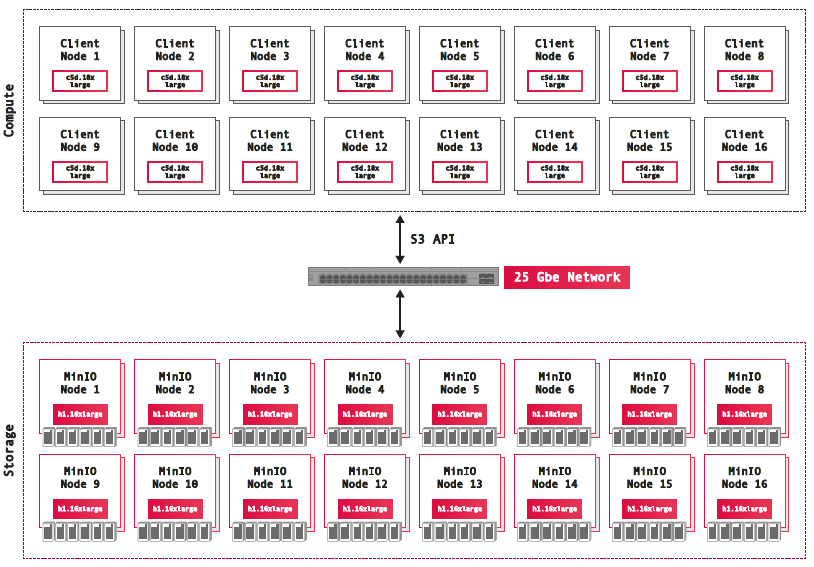

详细的服务器配置见下表：

| Instance | # Nodes | AWS Instance type | vCPU | MEM    | Storage     | Network |
|:--------:|:-------:|:-----------------:|:----:|:------:|:-----------:|:-------:|
|  Server  |      16 | h1.16xlarge       |   64 | 256 GB | 8 x 2TB HDD | 25 Gbps |
|  Client  |      16 | c5d.18xlarge      |   72 | 144 GB | 2 x 900 GB  | 25 Gbps |

测试结果得到的性能指标如下：

- Avg Read Throughput (GET): 10.81 GB/s
- Avg Write Throughput (PUT): 8.57 GB/s

其中存储服务器资源利用率为：

- Avg CPU% (millicpu): 1.4% (670)
- Avg Mem (GB): 11.23

每台这种配置的存储服务器可以支持约 2~3 个``带Depot``的 Vertica 节点。

#### 在配置NVMe SSD磁盘服务器上的性能指标

测试场景采用 [S3-benchmark](https://github.com/minio/s3-benchmark)，分别配置 8 台服务器作为存储服务器和测试客户端。

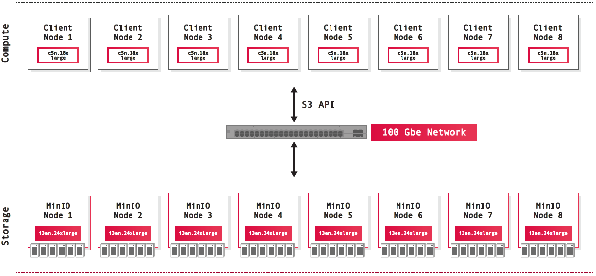

详细的服务器配置见下表：

| Instance | # Nodes | AWS Instance type | vCPU | MEM    | Storage          | Network  |
|:--------:|:-------:|:-----------------:|:----:|:------:|:----------------:|:--------:|
|  Server  |       8 | i3en.24xlarge     |   96 | 768 GB | 8 x 7500 GB NVMe | 100 Gbps |
|  Client  |       8 | c5n.18xlarge      |   72 | 144 GB | EBS              | 100 Gbps |

测试结果得到的性能指标如下：

- Avg Read Throughput (GET): 38.7 GB/s
- Avg Write Throughput (PUT): 34.4 GB/s

其中存储服务器资源利用率为：

- Avg CPU% (millicpu): 33.4% (321500)
- Avg Mem (GB): 38.4

每台这种配置的存储服务器可以支持约 5 个``不带Depot``(不用本地缓存热数据)的 Vertica 节点。

## Vertica 存储计算分离模式

Vertica 从一开始的事务处理和存储访问模型就保证不修改已有数据文件，以提供高效的列式有序压缩存储、海量数据高性能分析和数据处理能力。

从9.1版本开始， Vertica 支持可选的存储计算分离部署模式(Eon mode)。它重用了 Vertica 原来的优化器和执行引擎，但重构了元数据、存储和容错机制以便将数据存放在可靠的共享存储上，既能与原来无共享 MPP 列式存储架构支撑的工作负载的性能需求匹配，也能支持新的工作负载。新的分片(Sharding)订阅机制负责在节点间分配负载，但同时保留在节点本地执行表关联(Join)和分组聚合(Group By)计算的能力。以在 Amazon EC2 计算和 S3 存储上运行为例，存储计算分离模式表现出很好的性能、卓越的可扩展性和强健的可操作性，提供了对按需消费计算和存储资源的支持，提供更高效的性能、吞吐能力和集群自身弹性扩展能力。

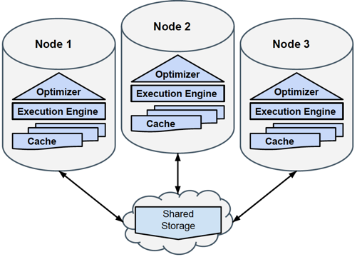

### Vertica 与 Minio 集成的参考配置

然而在现实当中，不是所有企业的业务和数据都适合立即搬到公有云上。可是企业内部以前很少有立即可用的高性价比对象存储来支撑 Vertica 卓越、创新的存储计算分离模式。

好在 Vertica 的存储计算分离模式支持与 AWS S3 API 兼容的对象存储服务。Minio 是高性价比、兼容 AWS S3 API 的对象存储方案，能与 Vertica 无缝地集成。

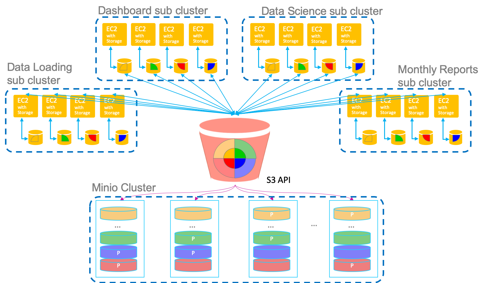

基于前文 [Minio 的性能指标](#Minio-的性能指标)，和 Vertica 的最佳实践，下面分别给出 Vertica 和 Minio 服务器的参考配置。

#### 机械磁盘类型服务器

这类配置的特点是存储容量大，性价比很高，尤其适合数据量大的业务场景。

- Vertica 数据库服务器参考配置：
  - ``CPU``: 24+ cores, 如 2 颗 Intel Xeon Gold Processors 6154 18-core 3.0GHz
  - ``内存``: 256+ GB
  - ``磁盘``: 2x 600+ GB NVMe SSD
  - ``RAID卡``: N/A
  - ``网卡``: 2x 10GbE

- Minio 对象存储服务器参考配置：每台可以支持约 3 个``带Depot``的 Vertica 节点
  - ``CPU``: 16+ cores，w/ SSSE3/AVX512/NEON，例如 2 颗 Intel E5-2620 V4
  - ``内存``: 64+ GB
  - ``磁盘``: 12x 4TB SATA
  - ``RAID卡``: N/A
  - ``网卡``: 2x 10GbE

#### NVMe SSD磁盘类型服务器

这类配置的特点是存储吞吐量高，单个 namesspace 的存储空间不是很大。但由于
Minio 纠删码的校验数据份数可以在 2~8(每16块盘)之间调整，能容错任意 2~8 个服务器故障，磁盘占比可以在 1.14~2.00 之间变化，容错能力和数据容量可以合理权衡。再加上 Vertica 的列式有序压缩存储提供的高压缩比，因此这类配置同样可以支撑上 PB 的业务数据。

由于 NVMe SSD 能够很容易提供比机械磁盘更高的吞吐能力，再加上企业内部网络拓扑相对简单、延时很小，于是 Vertica 数据库服务器完全可以不用为了缓存热数据而配置 Depot。这带来的好处是数据库节点完全无状态，可以快速弹性扩展(比如运行在容器环境)和节点故障复原，从而提供更高的性能、弹性和可用性。

- Vertica 数据库服务器参考配置：
  - ``CPU``: 24+ cores, 如 2 颗 Intel Xeon Gold Processors 6154 18-core 3.0GHz
  - ``内存``: 256+ GB
  - ``磁盘``: 2x 600+ GB NVMe SSD
  - ``RAID卡``: N/A
  - ``网卡``: 2x 10GbE

- Minio 对象存储服务器参考配置：每台服可以支持约 5 个``不带Depot``(不用本地缓存热数据)的 Vertica 节点
  - ``CPU``: 16+ cores，w/ SSSE3/AVX512/NEON，例如 2 颗 Intel E5-2620 V4
  - ``内存``: 64+ GB
  - ``磁盘``: 8x 750+ GB NVMe SSD
  - ``RAID卡``: N/A
  - ``网卡``: 2x 25GbE

#### 范例

以电信运营商经营分析业务场景为例，假定：

- 存量 3 年 2 PB 原始数据，Vertica 压缩比 10:1
- 批量业务热数据比例: 5%
- 常规报表热数据比例: 1%
- 自助分析热数据比例: 10%

如果采用``机械磁盘类型``，可配置：

- Minio 存储服务器数: 约 16 台， 容错任意 8(读)/7(写) 台服务器故障
- Vertica 批处理子集群服务器数: 约 32 台，提供 15 TB/h 加载、处理性能
- Vertica 常规报表子集群服务器数: 约 8 台
- Vertica 自助分析子集群服务器数: 约 16 台(改用 12x 600+ GB SAS 磁盘)

Vertica 和 Minio 集成的存储计算分离架构的有以下传统 MPP 数据库不具备的优点:

- 子集群隔离批量、常规报表、自助分析等负载，避免相互影响
- 易于横向扩展报表、自助分析的吞吐(并发)能力
- 每个子集群的服务器配置可以不同，允许存在代差
- 数据自动冷热区分，节点故障后可快速复原
- 高性价比

## 参考资料

1. [Object Storage vs. File Storage: What’s the Difference?](https://cloudian.com/blog/object-storage-vs-file-storage/).

1. [James S. Plank. 2013. Erasure Codes for Storage Systems](https://www.bing.com/search?q=Erasure+Codes+for+Storage+Systems+filetype:pdf).

1. [Backblaze Vaults: Zettabyte-Scale Cloud Storage Architecture](https://www.backblaze.com/blog/vault-cloud-storage-architecture/).

1. [Backblaze Open Sources Reed-Solomon Erasure Coding Source Code](https://www.backblaze.com/blog/reed-solomon/).

1. [MinIO is a high performance object storage server compatible with Amazon S3 APIs](https://github.com/minio/minio).

1. Ben Vandiver, Shreya Prasad, Pratibha Rana, Eden Zik, Amin Saeidi, Pratyush Parimal, Styliani Pantela, and Jaimin Dave. 2018. [Eon Mode: Bringing the Vertica Columnar Database to the Cloud](https://www.bing.com/search?q=Eon+Mode+Bringing+the+Vertica+Columnar+Database+to+the+Cloud+filetype:pdf). In *SIGMOD'18: 2018 International Conference on Management of Data, June 10--15, 2018, Houston, TX, USA.* ACM, New York, NY, USA, 13 pages.

1. [从无共享MPP列式数据库到弹性的云原生分析平台](from-sharing-nothing-mpp-db-to-native-cloud-analytic-platform.md).
